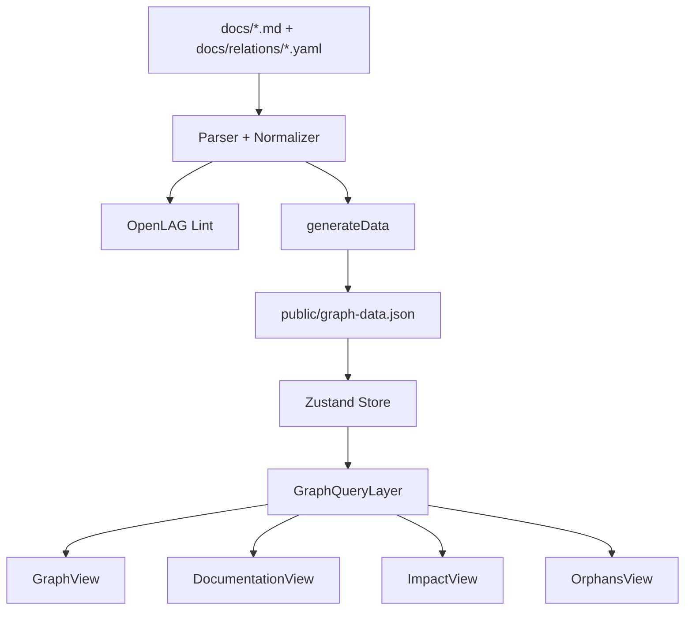
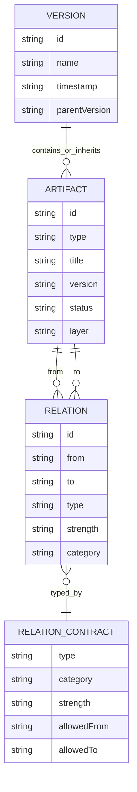

# Documentacion tecnica validada - OpenLAG

Documento validado contra el repositorio del proyecto y el paquete `@donartcha/openlag@0.1.8`.

Fecha de validacion: 2026-05-19.

## 1. Resumen ejecutivo

OpenLAG, Open Living Architecture Graph, es una herramienta de Architecture as Code para convertir documentacion tecnica versionada en Markdown y contratos YAML en un grafo de trazabilidad navegable.

El sistema lee los artefactos de `docs/`, extrae frontmatter y bloques YAML, genera `public/graph-data.json` y sirve una SPA React/Vite para explorar:

- versiones del sistema,
- artefactos arquitectonicos,
- relaciones de trazabilidad,
- huecos de cobertura,
- impacto de cambios,
- documentacion renderizada en Markdown y Mermaid.

La premisa central es mantener la arquitectura cerca del codigo, dentro del repositorio, con IDs estables y relaciones explicitas.

## 2. Estado actual validado

### Version y paquete

- Paquete NPM: `@donartcha/openlag`
- Version local: `0.1.8`
- Binario publicado: `openlag`
- Licencia: `MPL-2.0`
- Runtime soportado: Node.js `>=18`
- Tipo de modulo: ESM (`"type": "module"`)

### Validacion ejecutada

Comandos de validacion ejecutados desde la raiz del proyecto:

```bash
npm run check
npm run generate
node --import tsx scripts/cli/openlag.ts check
node bin/openlag.js --version
npm pack --dry-run
```

Resultado actual:

- `npm run check` pasa correctamente.
- `node bin/openlag.js --version` devuelve `0.1.8`.
- `npm pack --dry-run` genera la tarball `donartcha-openlag-0.1.8.tgz` e incluye la documentacion publica esperada.
- `DOCUMENTACION_OPENLAG.md` permanece excluido del paquete NPM.

Observaciones actuales:

- La inconsistencia publica `TEST` vs `TEST_CASE` fue corregida en artefactos de ejemplo, contratos de relacion, UI y definiciones generadas.
- ESLint sigue mostrando warnings por imports o variables sin uso, pero no errores.
- Vite advierte que algunos chunks superan 500 kB tras minificacion; no bloquea la release, pero queda como mejora futura.

Conclusion: el paquete queda preparado para una release NPM `0.1.8` con documentacion publica coherente y validaciones principales en verde.

## 3. Arquitectura general

OpenLAG esta compuesto por tres zonas principales:

1. **Fuente documental**
   - Directorio `docs/`.
   - Artefactos Markdown con YAML estructurado.
   - Contratos de relaciones en `docs/relations/*.yaml`.
   - Metadatos del portal en `metadata.json`.

2. **Motor local de generacion y validacion**
   - CLI en `scripts/cli/openlag.ts`.
   - Parser en `scripts/core/parser.ts` y modulos de `scripts/core/parser/`.
   - Linter en `scripts/lint/`.
   - Generador de contratos TypeScript en `scripts/generate-relations.ts`.

3. **Portal estatico**
   - Frontend React 19 + Vite.
   - Estado global con Zustand en `src/store.ts`.
   - Grafo visual con `@xyflow/react` y `dagre`.
   - Render Markdown/Mermaid en `src/components/MarkdownRenderer.tsx`.
   - Consultas de subgrafo en `src/core/graph/GraphQueryLayer.ts`.
   - Estrategias de proyeccion en `src/core/strategies/`.

No hay backend persistente ni API REST. El contrato principal entre generador y frontend es `public/graph-data.json`.

## 4. Estructura del repositorio

```text
OpenLAG/
  bin/
    openlag.js
  docs/
    architecture/
    changes/
    ci/
    deployment/
    design/
    implementation/
    incidents/
    maintenance/
    monitoring/
    operations/
    relations/
    requirements/
    testing/
    versions/
  public/
    graph-data.json
  scripts/
    cli/
    core/
    lint/
    generate-relations.ts
  src/
    components/
    core/
      generated/
      graph/
      registry/
      semantic/
      strategies/
    lib/
    utils/
    App.tsx
    store.ts
    types.ts
  tests/
```

Directorios clave:

- `docs/versions/`: versiones globales (`VERSION`) y versiones de sistemas/componentes (`SYSTEM_VERSION`).
- `docs/relations/`: contratos YAML de relaciones.
- `scripts/cli/`: comandos `init`, `generate`, `dev`, `build`, `lint`, `preview`, `check`.
- `scripts/core/parser.ts`: extraccion documental y normalizacion.
- `scripts/lint/`: reglas, perfiles y reporte de validacion.
- `src/core/registry/ArtifactRegistry.ts`: tipos oficiales de artefacto.
- `src/core/registry/RelationRegistry.ts`: contratos de relaciones generados.
- `src/core/generated/relation-definitions.ts`: archivo generado desde `docs/relations/*.yaml`.
- `src/core/graph/GraphQueryLayer.ts`: indices y proyeccion de subgrafos.
- `src/core/strategies/`: agrupaciones semanticas del portal.

## 5. Comandos disponibles

### CLI `openlag`

```text
openlag init       Inicializa docs, metadata y relaciones base.
openlag generate   Genera public/graph-data.json.
openlag dev        Genera datos, activa watcher de docs y arranca Vite.
openlag build      Genera datos y construye el portal estatico.
openlag lint       Valida documentacion y relaciones.
openlag preview    Previsualiza dist/.
openlag check      Ejecuta generate + lint de OpenLAG.
```

Opciones relevantes:

```bash
openlag init --name "Mi Sistema" --desc "Arquitectura del sistema"
openlag init --all
openlag generate --watch
openlag lint --profile feature
openlag lint --profile develop
openlag lint --profile release --strict
openlag lint --json
openlag check --profile release --strict
```

### Scripts NPM del repositorio

```text
npm run dev                 Ejecuta tsx scripts/cli/openlag.ts dev.
npm run generate            Ejecuta tsx scripts/cli/openlag.ts generate.
npm run generate-relations  Regenera src/core/generated/relation-definitions.ts.
npm run build               Regenera relaciones, construye web y CLI.
npm run build:web           Ejecuta vite build.
npm run build:cli           Compila la CLI con tsup.
npm run lint                Ejecuta ESLint.
npm run typecheck           Ejecuta tsc --noEmit.
npm run test                Ejecuta node --import tsx --test tests/*.test.ts.
npm run check               Ejecuta typecheck, lint, test y pack dry-run.
npm run clean               Borra dist y public/graph-data.json.
```

Nota importante: no existen scripts `lint:openlag`, `lint:openlag:feature` ni `lint:openlag:release` en el `package.json` actual. Para lint de arquitectura se debe usar `openlag lint` o `tsx scripts/cli/openlag.ts lint`.

## 6. Flujo de ejecucion

### Desarrollo local

```bash
npm install
npm run generate
npm run dev
```

`openlag dev` hace lo siguiente:

1. Resuelve `docs/` desde el proyecto donde se ejecuta.
2. Genera `public/graph-data.json`.
3. Activa un watcher con `chokidar` sobre `docs/`.
4. Arranca Vite usando la configuracion del paquete.
5. Inyecta `OPENLAG_PROJECT_ROOT` para que Vite opere contra el proyecto actual.

### Generacion de datos

`generateData()`:

1. Llama a `parseOpenLagDocs(docsDir)`.
2. Lee `metadata.json` si existe.
3. Construye un estado estatico con:
   - `versions`
   - `systemVersions`
   - `graphs`
   - `changes`
   - `metadata`
4. Para cada version, filtra artefactos por:
   - artefactos `VERSION`,
   - artefactos `SYSTEM_VERSION`,
   - artefactos con `version` igual a la version actual,
   - artefactos heredados por `parentVersion`.
5. Escribe `public/graph-data.json`.

### Runtime del portal

1. `src/main.tsx` monta `src/App.tsx`.
2. `initializeStore()` hace `fetch('/graph-data.json')`.
3. El estado se guarda en Zustand.
4. Al seleccionar version, se construye un `GraphIndex`.
5. `projectSubgraph()` calcula el subgrafo visible con filtros, foco y profundidad.
6. Las vistas `GraphView`, `DocumentationView`, `ImpactView` y `OrphansView` consumen el estado.

## 7. Contrato `graph-data.json`

Forma conceptual:

```ts
interface StaticState {
  versions: Version[];
  systemVersions: SystemVersion[];
  graphs: Record<string, GraphSnapshot>;
  changes: Change[];
  metadata?: {
    name: string;
    description: string;
    [key: string]: unknown;
  };
}
```

Cada `GraphSnapshot` contiene:

```ts
interface GraphSnapshot {
  artifacts: Artifact[];
  relations: Relation[];
}
```

Las relaciones usan `from` y `to`:

```ts
interface Relation {
  id: string;
  from: string;
  to: string;
  type: string;
  strength?: 'STRONG' | 'MEDIUM' | 'WEAK';
  category?: string;
}
```

## 8. Formato oficial de artefactos Markdown

El parser actual espera YAML con al menos:

- `id`
- `type`
- `title`
- `version`
- `description`

Campos recomendados:

- `status`
- `layer`
- `ownership`
- `relations`
- `systemVersionId`
- `subType`

Ejemplo valido para el parser actual:

```yaml
---
id: req-registration
type: REQUIREMENT
status: ready
layer: BUSINESS
title: User registration
version: v-1
description: Users must be able to create an account with validated data.
ownership:
  owner: product
  team: identity
relations:
  - type: REFINES
    to: epic-identity
---
```

Importante: el parser usa `to` para el destino de una relacion. Tambien acepta relaciones como string o con `id`, pero la forma recomendada y consistente con `Relation` es `to`. No se debe documentar `target` como campo principal mientras `scripts/core/parser.ts` no lo procese.

## 9. Tipos oficiales de artefacto

Declarados en `src/core/registry/ArtifactRegistry.ts`:

```text
PROJECT
EPIC
FEATURE
REQUIREMENT
BUSINESS_RULE
USE_CASE
DESIGN
DECISION
CODE_ENTITY
TEST_CASE
CHANGE
BUG
RISK
GLOSSARY_TERM
COMPONENT
API
DATABASE_ENTITY
DOCUMENTATION
INCIDENT
INFRASTRUCTURE
DEPLOYMENT
MONITORING
MAINTENANCE
SYSTEM_VERSION
VERSION
LIBRARY
ENVIRONMENT
CHECK
PROCESS
PIPELINE
```

Hallazgo resuelto para `0.1.8`: los contratos y artefactos publicos fueron normalizados para usar `TEST_CASE` como tipo oficial. `TEST` no forma parte del registry actual.

## 10. Estados oficiales

El esquema Zod acepta:

```text
draft
in_progress
ready
closed
deprecated
```

Efectos en lint:

- `draft`: degrada varias reglas a `info`, excepto errores estructurales fuertes.
- `in_progress`: degrada errores no estructurales a `warning`.
- `closed`: exige mayor coherencia; por ejemplo, ownership y relaciones a artefactos no pendientes.
- `deprecated`: se omiten reglas de trazabilidad, salvo validaciones ya calculadas de relaciones rotas.

## 11. Modelo semantico

### Capas

```text
BUSINESS
ARCHITECTURE
IMPLEMENTATION
OPERATIONS
DOCUMENTATION
```

### Ownership

```yaml
ownership:
  owner: persona-o-rol
  team: equipo
  domain: dominio
  maintainers:
    - backend
  reviewers:
    - architecture
  steward: governance
```

El linter actual exige ownership especialmente en APIs y artefactos `closed`.

## 12. Relaciones y contratos

Las relaciones se definen en `docs/relations/*.yaml`. Cada contrato incluye:

- `type`
- `description`
- `category`
- `strength`
- `allowedFrom`
- `allowedTo`
- `multiplicity`
- `validation.severity`

El script `npm run generate-relations` transforma estos YAML en `src/core/generated/relation-definitions.ts`. El `RelationRegistry` lee ese archivo generado.

Relaciones presentes actualmente:

```text
BLOCKS
BREAKS
CALLS
DEFINES
DEPENDS_ON
DEPLOYS
DERIVES_FROM
DOCUMENTS
FIXES
IMPACTS
IMPLEMENTS
IMPORTS
JUSTIFIES
MONITORS
REFINES
RELATES_TO
REPLACES
TESTS
USES
VALIDATES
```

Uso recomendado:

- `IMPLEMENTS`: codigo, componente, API o entidad tecnica implementa una necesidad.
- `TESTS`: `TEST_CASE` valida requisito, feature, codigo, API, bug o incidente.
- `REFINES`: descompone un artefacto en otro mas concreto.
- `FIXES`: conecta una correccion con un bug, incidente o riesgo.
- `DOCUMENTS`: conecta documentacion con lo descrito.
- `JUSTIFIES`: conecta decisiones o reglas con el elemento justificado.
- `DEPENDS_ON`, `USES`, `CALLS`, `IMPORTS`: modelan dependencias o uso estructural.
- `RELATES_TO`: debe evitarse salvo justificacion clara.

Limite actual: aunque los contratos declaran `allowedFrom` y `allowedTo`, las reglas de lint actuales validan tipo de relacion, destino existente y algunas reglas semanticas, pero no aplican de forma completa la matriz `allowedFrom`/`allowedTo`.

## 13. Parser documental

Entrada principal: `parseOpenLagDocs(docsDir)`.

Componentes:

- `scanDocs()`: descubre documentos.
- `normalizeArtifact()`: normaliza casing y campos.
- `ArtifactSchema`: valida estructura minima con Zod.
- `DiagnosticEngine`: acumula errores y advertencias.
- `RelationRegistry`: enriquece relaciones con categoria y fuerza.

Comportamiento relevante:

- YAML invalido lanza error critico.
- Bloques sin `id` o `type` se registran como diagnostico invalido.
- Relaciones sin `type` se omiten y generan warning.
- `VERSION`, `SYSTEM_VERSION` y `CHANGE` se copian tambien a listas especializadas del estado.
- El cuerpo Markdown posterior al bloque estructurado se conserva como `body`.

## 14. Linter de arquitectura

Perfiles:

```text
feature
develop
release
```

Reglas actuales:

- `duplicateId`
- `invalidYaml`
- `brokenRelation`
- `missingRequiredFields`
- `requirementWithoutImplementation`
- `requirementWithoutTest`
- `codeWithoutRequirement`
- `closedArtifactWithPendingRelations`
- `orphanArtifact`
- `invalidRelationType`
- `invalidArtifactType`
- `invalidLayerRelation`
- `missingOwnership`

`feature` es el perfil mas tolerante, `develop` es intermedio y `release` convierte mas huecos en errores.

Comandos:

```bash
openlag lint --profile develop
openlag lint --profile release --strict
openlag lint --json
```

Si el binario global no esta instalado, se puede usar `npx @donartcha/openlag <comando>`.

## 15. Frontend y exploracion de grafo

### Vistas principales

- `GraphView`: grafo interactivo con React Flow.
- `DocumentationView`: documentacion agrupada por estrategia semantica.
- `ImpactView`: analisis de impacto por relaciones.
- `OrphansView`: deteccion de huecos y artefactos aislados.
- `GuideView`: guia integrada.
- `SettingsView`: idioma, profundidad y visibilidad de weak relations.

### GraphQueryLayer

`src/core/graph/GraphQueryLayer.ts` crea indices:

- `artifactsById`
- `relationsBySource`
- `relationsByTarget`
- `artifactsByType`
- `artifactsByLayer`
- `artifactsByStatus`
- `artifactsByOwner`
- `artifactsByTeam`

Limites actuales:

```text
MAX_RENDER_NODES = 150
MAX_RENDER_EDGES = 300
DEFAULT_NEIGHBORHOOD_DEPTH = 1
MAX_EXPANSION_DEPTH = 3
HUB_COLLAPSE_THRESHOLD = 25
WEAK_RELATIONS_VISIBLE_BY_DEFAULT = false
```

El sistema puede explorar el grafo completo como base de conocimiento, pero la UI trabaja con subgrafos proyectados para evitar ruido y problemas de rendimiento.

### Estrategias de proyeccion

Registradas en `src/core/strategies/index.ts`:

- `lifecycle`
- `dependencies`
- `implementation`
- `validation`
- `architecture`
- `governance`
- `release`
- `domain`

Las estrategias agrupan artefactos para analizar el mismo grafo desde perspectivas diferentes. Algunas son implementaciones simples o placeholders funcionales, no ordenaciones topologicas completas.

## 16. Seguridad y despliegue

OpenLAG genera un portal estatico. No incluye autenticacion, RBAC ni cifrado de contenido.

Riesgo principal: todo lo escrito en `docs/` puede quedar publicado si `dist/` se despliega en un hosting publico. Esto puede incluir arquitectura interna, componentes sensibles, vulnerabilidades, incidentes o nombres de sistemas.

Recomendaciones:

- Publicar el portal solo en entornos internos o protegidos.
- Revisar `docs/` antes de desplegar.
- No incluir secretos, tokens, contrasenas ni URLs privadas sensibles.
- Usar VPN, autenticacion del servidor estatico o controles del hosting cuando el grafo describa sistemas reales.

## 17. Calidad, deuda y riesgos actuales

### P2

- Decidir si `allowedFrom`/`allowedTo` deben ser reglas efectivas de lint.
- Corregir warnings de trazabilidad del dataset de ejemplo:
  - codigo sin requisito asociado,
  - requisitos sin implementacion,
  - requisitos sin test.
- Vigilar que nuevos ejemplos publicos mantengan `relations[].to`.

### P3

- Revisar dependencias de exportacion/reporting (`jspdf`, `html-to-image`, `html2canvas`) y confirmar si siguen siendo necesarias.
- Documentar el contrato de `openlag.config.yml`, ya que el linter lo carga pero la documentacion del archivo de configuracion es limitada.
- Decidir si `npm run build` debe generar tambien `public/graph-data.json` en el flujo de paquete o si esa responsabilidad queda solo en `openlag build`.

## 18. Guia rapida para crear documentacion trazable

1. Crear o actualizar un artefacto en `docs/<categoria>/`.
2. Incluir `id`, `type`, `title`, `version` y `description`.
3. Usar `relations[].to`, no `target`.
4. Mantener IDs estables.
5. Preferir relaciones especificas sobre `RELATES_TO`.
6. Ejecutar:

```bash
openlag generate
openlag lint --profile develop
```

7. Para CI completo del repo:

```bash
npm run check
```

## 19. Diagramas

### Pipeline principal



### Modelo conceptual



## 20. Recomendaciones de cierre

Antes de considerar OpenLAG listo para release:

1. Regenerar relaciones con `npm run generate-relations` si cambian los YAML de `docs/relations/`.
2. Ejecutar `npm run typecheck`.
3. Ejecutar `openlag check --profile release --strict` si se quiere validar la arquitectura documental como gate de release.
4. Ejecutar `npm run check`.
5. Ejecutar `node bin/openlag.js --version`.
6. Ejecutar `npm pack --dry-run`.
7. Actualizar esta documentacion si cambian los contratos, comandos o tipos oficiales.
