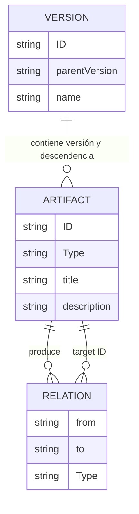

# Análisis Arquitectónico y Documentación Técnica - OpenLAG

## 1. Executive Summary
**OpenLAG** (*Open Living Architecture Graph*) es un motor de trazabilidad integral para el ciclo de vida del software construido sobre el paradigma de **Architecture as Code (AaC)**. Funciona extrayendo información estructurada de archivos Markdown y genera, de forma determinista, un portal estático interactivo. Este portal provee visibilidad de extremo a extremo: conectando requerimientos de negocio, diseño de arquitectura, entidades de código, y operaciones a lo largo del tiempo histórico del desarrollo. Al tratar la arquitectura, las decisiones y las dependencias como código versionable en el mismo repositorio que el software, genera un "grafo arquitectónico vivo" que refleja la complejidad y la verdad del sistema en cualquier versión dada.

## 2. Objetivo del Sistema
Resolver el riesgo clásico organizacional de tener "documentación muerta" o desincronizada mediante la materialización de la **Architecture as Code**. OpenLAG permite realizar:
- Comprensión transversal del proyecto para *onboardings*, manteniendo la arquitectura tan cerca del código como sea posible.
- Trazabilidad y validación de pruebas, demostrando enlaces determinísticos entre requerimientos y código de producción (Specs as Code).
- Análisis de impacto real ("Si cambio esta entidad, ¿qué casos de uso impacta?").
- Detección de "Huérfanos" (Requerimientos sin código asignado o código sin justificación de negocio).

## 3. Arquitectura General
**Paradigma:** **Architecture as Code (AaC)** soportado por un pipeline de Generador Estático de Sitios (SSG) / Extracción documental acoplado a una Single Page Application (SPA).
* **Capas y Flujo General:**
  1. **Capa Data Source / Storage:** Base de datos basada en ficheros (estilo *Git-Ops*). Carpeta local repleta de definiciones en Markdown (usando YAML Frontmatter / bloques inyectados).
  2. **Capa de Extracción (ETL):** Script CLI Node.js que escanea documentos, valida la descendencia versionada y consolida las serializaciones en un JSON final (grafo relacional).
  3. **Capa de Presentación (Frontend):** Cliente puro React, estáticamente servido, que absorbe el JSON global y renderiza de forma condicional vistas complejas de jerarquía, nodos y grafos.

## 4. Estructura del Repositorio
El repositorio presenta un patrón modular híbrido simplificado:
- `/bin/openlag.js`: Punto de entrada (CLI) local que expone comandos de manipulación (`generate`, `init`, `build`).
- `/docs/`: Directorio raíz de datos ("Source of truth"). Los requerimientos, arquitectura, tests y diseño del cliente residen aquí y se versionan. Especial relevancia tiene el archivo core `/docs/project-manifest.md`.
- `/scripts/generate-static-data.ts`: Micro-engine de persistencia. Componente hipercrítico que convierte la jerarquía física y los metadatos a la estructura normalizada final.
- `/src/`: Base de código de la interfaz gráfica React / Vite.
  - `/src/store.ts`: Gestor de contexto y memoria de la aplicación (Zustand).
  - `/src/types.ts`: Esquemas estables (Contratos / DTOs de Grafo, Versión, Sistemas, Impactos).
  - `/src/components/`: Vistas de usuario renderizables (GraphView, ImpactEngine, Orphans, Documentation).

## 5. Tecnologías Utilizadas
- **Lenguaje:** TypeScript (Asegura estricto tipado del modelo de Dominio).
- **Frontend Core:** React 19 + Vite (Rápido, Componentizado, Orientado al Cliente SPA).
- **Gestión de Estado Central**: `zustand` (Minimiza el overhead de contexto vs Redux).
- **Estilado:** TailwindCSS v4 acoplado con `lucide-react` para iteración acelerada.
- **Renderización Grafo:** Dependencias listadas sugieren soporte para renderizado usando `dagre` o `@xyflow/react` (React Flow) para posicionamiento matemático de jerarquías.
- **Parseo de Texto:** `js-yaml` + `gray-matter` (Lectura robusta de descriptores MarkDown).
- **Dependencias No Utilizadas (Deuda/Futuro):** `@google/genai` y `express` figuran listados, pero no están explícitamente acoplados a la generación de esta versión estática.

## 6. Flujo de Ejecución

1. **Al arrancar (Build phase):**
   - El desarrollador invoca `npm run dev` (que internamente hace `npm run generate`).
   - Se ejecuta el CLI. Se lee el `/docs/project-manifest.md` extrayendo el listado jerárquico de versiones padre/hijo.
   - El motor rastrea recursivamente `/docs`, parseando bloques condicionales YAML en cada Markdown y genera los Artefactos y Aristas (`Relations`).
   - El compilador calcula la "herencia" (función `isDescendant()`) para vincular qué códigos o entidades existían retrospectivamente. Imprime todo el dump en `public/graph-data.json`.
   - Inicia el webserver Vite.
2. **Durante operación (Runtime):**
   - El navegador ejecuta la SPA montada sobre `/src/main.tsx` -> `/src/App.tsx`.
   - Se invoca `initializeStore()`, desencadenando un Fetch asíncrono puro directo a `graph-data.json` y cargando en memoria (Store Zustand).
   - El usuario interactúa mutando selectores del top-bar del Header (`store.setVersionId`) re-renderizando las ramificaciones condicionalmente para ver la red (Graph) vs Documentos apilados.

## 7. Modelo de Dominio
Modelo orientado directamente a Graph-Network Series temporales.
- **`Version`**: Representa un momento cronológico de captura (commits/releases). (Tiene ID y `parentVersion`).
- **`Artifact`**: Es el **TODO** de la plataforma. Subdivido por Types (`REQUIREMENT`, `DESIGN`, `CODE_ENTITY`, `TEST`, etc.).
- **`Relation`**: Las aristas lógicas y unidireccionales que interconectan (`DERIVES_FROM`, `IMPLEMENTS`, `FIXES`, `TESTS`).
- **`Change` / `SystemVersion`**: Componentes auxiliares de tracking de incidencias de Ops, Evolutivos.

## 8. APIs y Contratos
Actualmente el sistema no requiere persistencia online, colas de eventos (RabbitMQ) o API REST para ingesta concurrente.
El único "Contrato" de Integración es de lectura:
- **`graph-data.json`**: El contrato en bruto entre el Backend estático temporal y el Renderizado del Cliente. Sigue fielmente la estructura TypeScript `StaticState`.

## 9. Persistencia
**Estrategias:** *Stateless Database / File-driven.* El estado completo de la Base de Datos es volátil y transitorio, ensamblándose íntegramente gracias al File System plano bajo Markdown.
**Riesgos Inminentes:** Si un desarrollador tipea erróneamente un identificador (`ID` en YAML) o una relación (Target ID roto), el parser arrojará un "Huérfano" no detectable o causará roturas estáticas al ignorar `catch (e)` silenciosamente.

## 10. Gestión de Contexto y Agentes (Estado Actual de IA)
**Verificación Estricta:** Tras el escrutinio profundo del repositorio, a pesar de incluir dependencias preparatorias como `@google/genai` en el `package.json`, **el sistema NO implementa actualmente Agentes Contextuales ni llamadas a LLMs**.
- No existe memoria RAG o base de datos de Vectores (Vector DB).
- No hay persistencia conversacional o lógica de "Copilot" inyectada.
- **Hipótesis fundamentada:** La arquitectura fue construida para integrarse paralelamente a un Agente de IA, cuyo rol futuro será correr independientemente sobre un repositorio ajeno, e inferir/traducir las clases de Java/Go a estos archivos Markdown (`Artefactos`), pero el código actual refleja exclusivamente el Motor de Lifecycle que lo lee una vez hecho esto offline por humanos.

## 11. Seguridad
La aplicación es cliente total (Static SPA), careciendo de capa de autenticación, JWT o roles RBAC. Si `/dist/` es desplegado a producción pública (por ej. NGINX), las IPs, vulnerabilidades, deuda técnica, nombres de nodos y diseños expuestos bajo los ficheros Markdown son públicos y representan un riesgo fatal de Seguridad Perimetral y de Ingeniería Inversa. Se recomienda estricto ocultamiento bajo VPN o Auth-Guard básico del servidor estático.

## 12. DevOps y Despliegue
- El Pipeline de CI/CD subyacente que un administrador ejecutaría sería tan trivial como correr `npm install`, seguido de `npm run build` y trasladar los *assets* cacheados hacia artefactos o plataformas Dockerizadas (`FROM nginx:alpine`).

## 13. Calidad del Código (Auditoría)
- **Mantenibilidad & Modularidad:** Alta en FrontEnd. El desacople del estado (Zustand puro vs Componentes con inyección de hooks) es excelente y limpio. `types.ts` evita duplicaciones peligrosas en variables mágicas.
- **Cohesión vs Acoplamiento (Pipeline):** El `generate-static-data.ts` del CLI posee *mala* legibilidad. Excesiva carga ciclomática, parseos rudimentarios por Expresiones Regulares sobre ficheros de texto (ej. Regex de Yaml block) propenso a roturas estructurales inesperadas en un gran repositorio.
- **Deuda y Robustez:** Fallos en `catch (e) { continue; }` para el procesamiento del data extractor son un "Smell code". Los errores de lectura deberían hacer abortar por prevención la compilación estática (Throw exception / Fail Fast).

## 14. Deuda Técnica (Lista Priorizada)
1. **Silenciado de Errores Críticos (P1):** Fallos al parsear los metadatos YAML ocultan pérdidas de datos transaccionales, se requiere implementación `throw new Error(...)` en el Script Builder.
2. **Dependencias Abruptas o "Zombie" (P2):** Retirar `express`, `dotenv`, `@google/genai` del manifest de dependencias, reduciendo vulnerabilidades o bien efectuar de inmediato la integración planificada para ellas (Generación Autómoma por Agentes).
3. **Pérdida de Features (P3):** Reciente parche de rollback eliminó librerías PDF que siguen acopladas y presentes en NPM como `jspdf` y `html-to-image`; limpiar dichas dependencias.

## 15. Riesgos Arquitectónicos (Escalabilidad en Producción)
1. **Punto de Quiebre Memoria Cliente (OOM Frontend):** A nivel empresarial, el Grafo pasará rápidamente de 50 entidades a 10.000 entidades y 40.000 conectores. Descargar todo esto de golpe en `graph-data.json` a Memoria JS y representarlo con un SVG/Canvas matará en latencia y recursos a los navegadores que abran OpenLAG.

## 16. Recomendaciones Técnicas (Mejoras Proactivas)
1. **Sustituir parseo estricto MDX:** Implementar la lectura del YAML bajo validadores tipados como `Zod` o `Joi` asegurando de forma nativa que IDs inexistentes sean alertados.
2. **Lazy Node Loading:** En componentes de XYFlow (Grafo Pizarras) integrar "Pagination nodes" cargables por demanda si rebasan +300 elementos.
3. **Backend Ligero Híbrido:** Reactivar la dependencia `express`, montando un micro-servidor en lugar de leer un Static JSON. Esto preparará a la App para inyectar Gemini (Agente Generativo) permitiendo requerir consultas o grafos al vuelo reduciendo la carga final.

## 17. Roadmap Propuesto (Madurez a 1 año)
- **Fase 1 (Corto Plazo): Core Enforcement**. Introducir esquemas de Zod al generador `ts`, sanear `package.json` de código muerto del "generador/pdf", y mejorar testing.
- **Fase 2 (Mediano Plazo): Full-AI Integration Engine**. Montar el servidor `Express` usando la dependencia `@google/genai` persistente, donde el Engine no solo lea MD, sino que actúe en el *Post-Commit Hook* consumiendo el repositorio vivo y auto-traduciendo el Código a Artefactos MD y Relaciones automáticamente.
- **Fase 3 (Largo Plazo): Graph Database Transition**. Evolución natural a uso de base de datos Grafo dedicada en memoria persistente de Backend (Neo4j, ArangoDB o Postgres Graph extensions) en lugar de ficheros locales con un Dashboard interactivo RBAC.

## 18. Diagramas

### Diagrama de Arquitectura de OpenLAG
```mermaid
graph TD
    subgraph Data Layer [Source of Truth - Git / Local Storage]
        MF(project-manifest.md)
        DIR(docs/ Directorio Recursivo)
        MF -.-> DIR
    end

    subgraph Compiler [Local Build Engine / CLI]
        CLI(openlag.js) --> GEN(generate-static-data.ts)
        GEN -- Parsea YAML Blocks --> DIR
        GEN -- Resuelve Aristas e Historico --> JSON(graph-data.json)
    end

    subgraph Client App [Frontend React - Vite SPA]
        ZUS(Zustand Data Store) <== Fetch API == JSON
        ZUS --> GR(GraphView)
        ZUS --> DC(Documentation Engine)
        ZUS --> IMP(Impact Analysis)
        ZUS --> ORP(Orphan Tracking)
    end

    Client App -. "No API, Solo Lectura JSON" .-> JSON
```

### Modelo Relacional Simplificado


## 19. Sistema de Linting (Architecture as Code Validator)

**Propósito:**
OpenLAG incluye un motor de validación (Linter CLI) que asegura la trazabilidad, coherencia y calidad de la documentación "Architecture as Code" sin penalizar el flujo de trabajo ágil. Fue diseñado para ser progresivo: permite huecos de información en artefactos recientes (`draft`, `in_progress`) y penaliza estrictamente las carencias en fases de `release`.

**Comandos y Casos de Uso:**
```bash
npm run lint:openlag           # Perfil 'develop' por defecto
npm run lint:openlag:feature   # Perfil relajado
npm run lint:openlag:release   # Perfil estricto

# Ejecución manual en consola con reporte JSON:
npx tsx scripts/lint-cli.ts --profile develop --json
```

**Perfiles de Severidad:**
- **`feature`**: Relajado. Solo caen errores estructurales fuertes (esquemas rotos o IDs duplicados). Faltas de tests o implementación son alertas `info`.
- **`develop`**: Intermedio. Penaliza con `warnings` requerimientos sin test o código huérfano.
- **`release`**: Estricto. Exige trazabilidad completa y de ida y vuelta para todos los objetos marcando ausencias como `error`.

**Diseño e Implementación:**
1. **Separación Core-React**: La lógica de validación reside al 100% en `scripts/`, aislándola del frontend SPA en Vite. Garantiza ligereza de cómputo en integración continua (CI).
2. **Parser Unificado**: Se rompió el monolito de `generate-static-data.ts`. Se extrajo la capa de lectura (ETL) a `scripts/core/parser.ts`. Ahora el motor de generación y el Linter consumen una misma verdad que recorre y normaliza los `.md`.
3. **Máquina de Severidad Sensible a Estado**: El motor ajusta la severidad de las reglas dinámicamente si reconoce la propiedad `status:` del frontmatter. Los documentos en `status: draft` atenúan sus carencias estructurales.
4. **API Agnóstica**: Retorna un objeto `LintReport` estructurado sin emitir logs de consola bloqueantes, permitiendo que otros módulos o pipelines consuman las validaciones directamente con `--json`.
5. **Grafo Plano**: Las validaciones se ejecutan localmente mediante diccionarios y grafos planos indexados (estructuras `Map`), evitando árboles recursivos lentos y permitiendo validar el gran volumen documental en sub-milisegundos.

**Limitaciones Conocidas del Linter:**
- Actualmente no parsea el contenido _cuerpo Markdown_ interno (Markdown AST) de los documentos para ver referencias en línea; solo el bloque estructurado o YAML FrontMatter.
- La extensión y configuración de roles desde `openlag.config.yml` asume configuración perfecta por parte del usuario (Deuda técnica: requiere estricto parseo usando `Zod`).