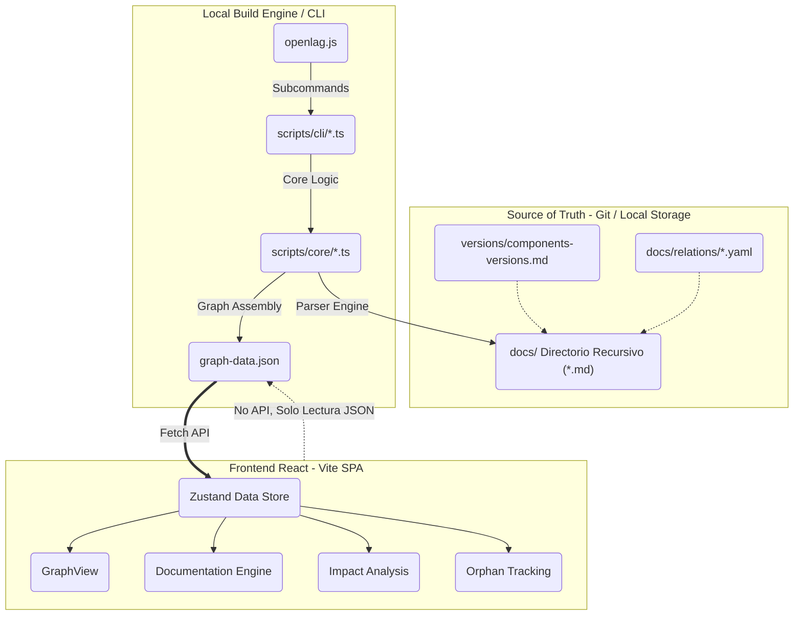
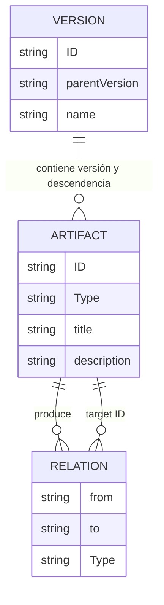

# Análisis Arquitectónico y Documentación Técnica - OpenLAG

## 1. Executive Summary
**OpenLAG** (*Open Living Architecture Graph*) es un motor de trazabilidad integral para el ciclo de vida del software construido sobre el paradigma de **Architecture as Code (AaC)**. Funciona extrayendo información estructurada de archivos Markdown y genera, de forma determinista, un portal estático interactivo. Este portal provee visibilidad de extremo a extremo: conectando requerimientos de negocio, diseño de arquitectura, entidades de código, y operaciones a lo largo del tiempo histórico del desarrollo. Al tratar la arquitectura, las decisiones y las dependencias como código versionable en el mismo repositorio que el software, genera un "grafo arquitectónico vivo" que refleja la complejidad y la verdad del sistema en cualquier versión dada.

## 2. Objetivo del Sistema
Resolver el riesgo clásico organizacional de tener "documentación muerta" o desincronizada mediante la materialización de la **Architecture as Code**. OpenLAG permite realizar:
- Comprensión transversal del proyecto para *onboardings*, manteniendo la arquitectura tan cerca del código como sea posible.
- Trazabilidad y validación de pruebas, demostrando enlaces determinísticos entre requerimientos y código de producción (Specs as Code).
- Análisis de impacto real ("Si cambio esta entidad, ¿qué casos de uso impacta?").
- Detección de "Huérfanos" (Requerimientos sin código asignado o código sin justificación de negocio).

## 3. Arquitectura General
**Paradigma:** **Architecture as Code (AaC)** soportado por un pipeline de Generador Estático de Sitios (SSG) / Extracción documental acoplado a una Single Page Application (SPA).
* **Capas y Flujo General:**
  1. **Capa Data Source / Storage:** Base de datos basada en ficheros (estilo *Git-Ops*). Carpeta local repleta de definiciones en Markdown (usando YAML Frontmatter / bloques inyectados).
  2. **Capa de Extracción (ETL):** Script CLI Node.js que escanea documentos, valida la descendencia versionada y consolida las serializaciones en un JSON final (grafo relacional).
  3. **Capa de Presentación (Frontend):** Cliente puro React, estáticamente servido, que absorbe el JSON global y renderiza de forma condicional vistas complejas de jerarquía, nodos y grafos.

## 4. Estructura del Repositorio
El repositorio presenta un patrón modular híbrido simplificado:
- `/bin/openlag.js`: Punto de entrada (CLI) oficial que expone todos los comandos del sistema (`init`, `dev`, `generate`, `lint`, `build`, `check`).
- `/docs/`: Directorio raíz de datos ("Source of truth"). Los requerimientos, arquitectura, tests y diseño del cliente residen aquí y se versionan. Especial relevancia tienen los archivos en `/docs/versions/` (donde cada artefacto `VERSION` y `SYSTEM_VERSION` se define en su propio archivo markdown independiente). Estos exigen validación estructural estricta incluyendo campos obligatorios como `layer`, `title`, `description`, `ownership` (owner, team) y `relations` explícitas, para evitar problemas de trazabilidad.
- `/scripts/cli/`: Contiene la lógica de implementación de cada subcomando de la CLI.
- `/scripts/core/`: Motores de procesamiento agnósticos (Parser, Graph Engine).
- `/src/`: Base de código de la interfaz gráfica React / Vite.
  - `/src/store.ts`: Gestor de contexto y memoria de la aplicación (Zustand).
  - `/src/types.ts`: Esquemas estables (Contratos / DTOs de Grafo, Versión, Sistemas, Impactos).
  - `/src/components/`: Vistas de usuario renderizables (GraphView, ImpactEngine, Orphans, Documentation).

## 5. Tecnologías Utilizadas
- **Lenguaje:** TypeScript (Asegura estricto tipado del modelo de Dominio).
- **Frontend Core:** React 19 + Vite (Rápido, Componentizado, Orientado al Cliente SPA).
- **Gestión de Estado Central**: `zustand` (Minimiza el overhead de contexto vs Redux).
- **Estilado:** TailwindCSS v4 acoplado con `lucide-react` para iteración acelerada.
- **Renderización Grafo:** Dependencias listadas sugieren soporte para renderizado usando `dagre` o `@xyflow/react` (React Flow) para posicionamiento matemático de jerarquías.
- **Parseo de Texto:** `js-yaml` + `gray-matter` (Lectura robusta de descriptores MarkDown).
- **Dependencias No Utilizadas (Deuda/Futuro):** `@google/genai` figura listada, pero no está explícitamente acoplada a la generación de esta versión estática.

## 6. Flujo de Ejecución

1. **Al arrancar (Build phase):**
   - El desarrollador invoca `npm run dev` (que internamente hace `npm run generate`).
   - Se ejecuta el CLI. Se leen los archivos bajo `/docs/versions/` extrayendo el listado jerárquico de versiones globales y versiones de componentes.
   - El motor rastrea recursivamente `/docs`, parseando bloques condicionales YAML en cada Markdown y genera los Artefactos y Aristas (`Relations`).
   - El compilador calcula la "herencia" (función `isDescendant()`) para vincular qué códigos o entidades existían retrospectivamente. Imprime todo el dump en `public/graph-data.json`.
   - Inicia el webserver Vite.
2. **Durante operación (Runtime):**
   - El navegador ejecuta la SPA montada sobre `/src/main.tsx` -> `/src/App.tsx`.
   - Se invoca `initializeStore()`, desencadenando un Fetch asíncrono puro directo a `graph-data.json` y cargando en memoria (Store Zustand).
   - El usuario interactúa mutando selectores del top-bar del Header (`store.setVersionId`) re-renderizando las ramificaciones condicionalmente para ver la red (Graph) vs Documentos apilados.

## 7. Gobernanza Semántica y Contratos de Relaciones

OpenLAG introduce relaciones como contratos explícitos, garantizando la gobernanza semántica. A diferencia de grafos de conocimiento libres, OpenLAG impone un diseño orientado a evitar la polución semántica.

### Human Relations vs Synthetic Relations
El marco conceptual distingue dos orígenes de conexión:
- **Human Relations:** Crean justificaciones del "por qué" operan así las cosas (ej: `IMPLEMENTS`, `TESTS`, `JUSTIFIES`, `REFINES`). Requieren de la intervención e intención humana y construyen trazabilidad.
- **Synthetic Relations:** Definen estructuralmente "cómo" ensambla y opera el software (ej: `DEPENDS_ON`, `CALLS`, `IMPORTS`, `USES`). Resultan idóneas para, a largo plazo, ser inferidas estáticamente mediante tooling sin intervención humana.

### Estructura Registral
La gobernanza asume dos pilares técnicos:
1. **RelationRegistry (Dinámico y Configurable):** Las reglas arquitectónicas (relaciones) se definen de forma descentralizada mediante contratos explícitos en formato YAML ubicados en `/docs/relations/*.yaml`. Definen el propósito, multiplicidad, artefactos origen (`allowedFrom`) / destino (`allowedTo`), y severidad de validación. OpenLAG procesa instántaneamente estos contratos usándolos como las leyes del motor de validaciones sin depender de configuraciones 'hardcodeadas'.
2. **ArtifactRegistry (Estable e Integral):** A diferencia de las reglas del grafo, el catálogo de Artefactos (ej: `REQUIREMENT`, `FEATURE`) reside bajo el núcleo del código. Los artefactos en sí documentados (las instancias) se redactan puramente como **archivos Markdown legibles por humanos (.md)**. De esta forma, nunca recargamos la capa física con puros archivos YAML limitando la experiencia del desarrollador, manteniendo la legibilidad transparente para Gitea/Github dentro de carpetas clásicas (`/docs/features`, `/docs/requirements`).

### Prevención de Polución y Ciclo de Vida
Este motor de contratos permite que el `ValidationEngine` exponga diagnósticos precisos ante inconsistencias arquitectónicas. Relaciones perezosas o sin carga descriptiva (como `RELATES_TO`) se encuentran etiquetadas como **DISCOURAGED** requiriendo validación explícitamente y limitando la creación colosal y redundante del grafo ("Spaghetti Graph"). Además, las relaciones de trazabilidad secundaria (`DOCUMENTS`, `JUSTIFIES`) están preparadas para no quebrar el esquema de estado final de los artefactos que se encuentren cerrados o liberados.

## 8. APIs y Contratos
Actualmente el sistema no requiere persistencia online, colas de eventos (RabbitMQ) o API REST para ingesta concurrente.
El único "Contrato" de Integración es de lectura:
- **`graph-data.json`**: El contrato en bruto entre el Backend estático temporal y el Renderizado del Cliente. Sigue fielmente la estructura TypeScript `StaticState`.

## 9. Persistencia
**Estrategias:** *Stateless Database / File-driven.* El estado completo de la Base de Datos es volátil y transitorio, ensamblándose íntegramente gracias al File System plano bajo Markdown.
**Riesgos Inminentes:** Si un desarrollador tipea erróneamente un identificador (`ID` en YAML) o una relación (Target ID roto), el parser arrojará un "Huérfano" no detectable o causará roturas estáticas al ignorar `catch (e)` silenciosamente.

## 10. Gestión de Contexto y Agentes (Estado Actual de IA)
**Verificación Estricta:** Tras el escrutinio profundo del repositorio, a pesar de incluir dependencias preparatorias como `@google/genai` en el `package.json`, **el sistema NO implementa actualmente Agentes Contextuales ni llamadas a LLMs**.
- No existe memoria RAG o base de datos de Vectores (Vector DB).
- No hay persistencia conversacional o lógica de "Copilot" inyectada.
- **Hipótesis fundamentada:** La arquitectura fue construida para integrarse paralelamente a un Agente de IA, cuyo rol futuro será correr independientemente sobre un repositorio ajeno, e inferir/traducir las clases de Java/Go a estos archivos Markdown (`Artefactos`), pero el código actual refleja exclusivamente el Motor de Lifecycle que lo lee una vez hecho esto offline por humanos.

## 11. Seguridad
La aplicación es cliente total (Static SPA), careciendo de capa de autenticación, JWT o roles RBAC. Si `/dist/` es desplegado a producción pública (por ej. NGINX), las IPs, vulnerabilidades, deuda técnica, nombres de nodos y diseños expuestos bajo los ficheros Markdown son públicos y representan un riesgo fatal de Seguridad Perimetral y de Ingeniería Inversa. Se recomienda estricto ocultamiento bajo VPN o Auth-Guard básico del servidor estático.

## 12. DevOps y Despliegue
- El Pipeline de CI/CD subyacente que un administrador ejecutaría sería tan trivial como correr `npm install`, seguido de `npm run build` y trasladar los *assets* cacheados hacia artefactos o plataformas Dockerizadas (`FROM nginx:alpine`).

## 13. Calidad del Código (Auditoría)
- **Mantenibilidad & Modularidad:** Alta en FrontEnd. El desacople del estado (Zustand puro vs Componentes con inyección de hooks) es excelente y limpio. `types.ts` evita duplicaciones peligrosas en variables mágicas.
- **Cohesión vs Acoplamiento (Pipeline):** El motor de procesamiento (`scripts/core/parser.ts`) ha sido refactorizado para centralizar la lógica de extracción. Se recomienda seguir eliminando parseos manuales por Expresiones Regulares en favor de un parser Markdown robusto (AST) para evitar roturas estructurales inesperadas.
- **Deuda y Robustez:** Fallos en `catch (e) { continue; }` para el procesamiento del data extractor son un "Smell code". Los errores de lectura deberían hacer abortar por prevención la compilación estática (Throw exception / Fail Fast).

## 14. Deuda Técnica (Lista Priorizada)
1. **Silenciado de Errores Críticos (P1):** Fallos al parsear los metadatos YAML ocultan pérdidas de datos transaccionales, se requiere implementación `throw new Error(...)` en el Script Builder.
2. **Dependencias Abruptas o "Zombie" (P2):** Retirar `@google/genai` del manifest de dependencias, reduciendo vulnerabilidades o bien efectuar de inmediato la integración planificada para ellas (Generación Autómoma por Agentes).
3. **Pérdida de Features (P3):** Reciente parche de rollback eliminó librerías PDF que siguen acopladas y presentes en NPM como `jspdf` y `html-to-image`; limpiar dichas dependencias.

## 15. Riesgos Arquitectónicos (Escalabilidad en Producción mitigada)
1. **Punto de Quiebre Memoria Cliente (OOM Frontend):** A nivel empresarial, el Grafo pasará rápidamente de 50 entidades a 10.000 entidades y 40.000 conectores. Descargar todo esto de golpe en `graph-data.json` a Memoria JS y representarlo con un SVG/Canvas mataría los navegadores. **Mitigación implementada**: Se ha introducido `GraphQueryLayer` (Focus Mode, límites de profundidad configurables, filtrado lógico por semántica y agrupación progresiva) asegurando que el renderizado se acote y manipule únicamente lo esencial para el ecosistema, recortando el resto.
2. **Generación Monolítica JSON**: Aunque la parte interactiva del portal visualiza *sub-grafos*, actualmente sigue existiendo un `graph-data.json` gigante y global descargado inicialmente por el Frontend. Si la red se ralentiza, el Time To Interactive será severo. (Fase futura: fragmentación estática de slices de red).

## 16. Recomendaciones Técnicas (Mejoras Proactivas aplicadas y futuras)
1. **Validación Estricta y Semántica:** Ya mitigado en gran medida; El Lint OpenLAG nativo valida enlaces y advierte errores si target IDs no existen o existen inconsistencias de Relaciones.
2. **Exploración por Subgrafos (Aplicado):** El grafo ha dejado de renderizar todo ciegamente, moviéndose a un modelo de "Proyección de Subgrafo", ocultando uniones estáticas (weak links como RELATES_TO) y requiriendo acción explícita mediante profundidad (Neighborhood exploration) o Focus Node selectivo, soportando *Trimming de Hubs* mayores a 150 nodos simultáneos.
3. **Backend BFF Opcional (Futuro):** Ante mega-grafos donde los metadatos pesen más de 50MB, se requerirá abandonar el enfoque "solo archivos S3/GitHub" e instanciar un pequeño backend GraphQL de OpenLAG.
3. **Backend Ligero Híbrido:** Reactivar la dependencia `express`, montando un micro-servidor en lugar de leer un Static JSON. Esto preparará a la App para inyectar Gemini (Agente Generativo) permitiendo requerir consultas o grafos al vuelo reduciendo la carga final.

## 17. Roadmap Propuesto (Madurez a 1 año)
- **Fase 1 (Corto Plazo): Core Enforcement**. Introducir esquemas de Zod al generador `ts`, sanear `package.json` de código muerto del "generador/pdf", y mejorar testing.
- **Fase 2 (Mediano Plazo): Full-AI Integration Engine**. Montar el servidor `Express` usando la dependencia `@google/genai` persistente, donde el Engine no solo lea MD, sino que actúe en el *Post-Commit Hook* consumiendo el repositorio vivo y auto-traduciendo el Código a Artefactos MD y Relaciones automáticamente.
- **Fase 3 (Largo Plazo): Graph Database Transition**. Evolución natural a uso de base de datos Grafo dedicada en memoria persistente de Backend (Neo4j, ArangoDB o Postgres Graph extensions) en lugar de ficheros locales con un Dashboard interactivo RBAC.

## 18. Diagramas

### Diagrama de Arquitectura de OpenLAG


### Modelo Relacional Simplificado


## 19. Sistema de Linting (Architecture as Code Validator)

**Propósito:**
OpenLAG incluye un motor de validación (Linter CLI) que asegura la trazabilidad, coherencia y calidad de la documentación "Architecture as Code" sin penalizar el flujo de trabajo ágil. Fue diseñado para ser progresivo: permite huecos de información en artefactos recientes (`draft`, `in_progress`) y penaliza estrictamente las carencias en fases de `release`.

**Comandos y Casos de Uso:**
```bash
npm run lint:openlag           # Perfil 'develop' por defecto
npm run lint:openlag:feature   # Perfil relajado
npm run lint:openlag:release   # Perfil estricto

# Ejecución manual en consola con reporte JSON:
npx openlag lint --profile develop --json
```

**Perfiles de Severidad:**
- **`feature`**: Relajado. Solo caen errores estructurales fuertes (esquemas rotos o IDs duplicados). Faltas de tests o implementación son alertas `info`.
- **`develop`**: Intermedio. Penaliza con `warnings` requerimientos sin test o código huérfano.
- **`release`**: Estricto. Exige trazabilidad completa y de ida y vuelta para todos los objetos marcando ausencias como `error`.

**Diseño e Implementación:**
1. **Separación Core-React**: La lógica de validación reside al 100% en `scripts/`, aislándola del frontend SPA en Vite. Garantiza ligereza de cómputo en integración continua (CI).
2. **Parser Unificado**: Se rompió el monolito de `generate-static-data.ts`. Se extrajo la capa de lectura (ETL) a `scripts/core/parser.ts`. Ahora el motor de generación y el Linter consumen una misma verdad que recorre y normaliza los `.md`.
3. **Máquina de Severidad Sensible a Estado**: El motor ajusta la severidad de las reglas dinámicamente si reconoce la propiedad `status:` del frontmatter. Los documentos en `status: draft` atenúan sus carencias estructurales.
4. **API Agnóstica**: Retorna un objeto `LintReport` estructurado sin emitir logs de consola bloqueantes, permitiendo que otros módulos o pipelines consuman las validaciones directamente con `--json`.
5. **Grafo Plano**: Las validaciones se ejecutan localmente mediante diccionarios y grafos planos indexados (estructuras `Map`), evitando árboles recursivos lentos y permitiendo validar el gran volumen documental en sub-milisegundos.
6. **Registros Centralizados y Contratos Dinámicos**: El Linter ha delegado completamente los arrays de validación (hardcodes) evaluando los documentos contra el `RelationRegistry` (cargado dinámicamente de los *metadata contracts* `.yaml`) mientras avala la integridad de los tipos desde la fuente `ArtifactRegistry`.

**Limitaciones Conocidas del Linter:**
- Actualmente no parsea el contenido _cuerpo Markdown_ interno (Markdown AST) de los documentos para ver referencias en línea; solo el bloque estructurado o YAML FrontMatter.
- La extensión y configuración de roles desde `openlag.config.yml` asume configuración perfecta por parte del usuario (Deuda técnica: requiere estricto parseo usando `Zod`).

## 20. Guía de Uso del Proyecto NPM

Para utilizar **OpenLAG** en tu entorno local de desarrollo, el proyecto está configurado como un proyecto Node.js estándar.

### Requisitos Previos
- Node.js instalado (v18 o superior recomendado)
- `npm` (gestor de dependencias)

### Comandos Principales (CLI)

OpenLAG se gestiona a través de su propia CLI. Puedes ejecutar los comandos usando `npm run <command>` o directamente mediante `npx openlag <command>`.

1. **Instalar dependencias:**
   ```bash
   npm install
   ```

2. **Desarrollo (Modo "Live"):**
   Inicia el visualizador con recarga en vivo de datos. Regenera automáticamente el grafo cuando detecta cambios en `/docs`.
   ```bash
   npm run dev
   # o
   npx openlag dev
   ```

3. **Generación Manual de Datos:**
   Si prefieres generar el JSON sin levantar el servidor o sincronizarlo manualmente:
   ```bash
   npm run generate
   # o
   npx openlag generate [--watch]
   ```

4. **Construcción (Producción):**
   Genera los datos del grafo y compila la aplicación para despliegue estático en `dist/`.
   ```bash
   npm run build
   # o
   npx openlag build
   ```

5. **Linting y Validación:**
   Evalúa la calidad de la documentación.
   ```bash
   npm run lint:openlag
   # o
   npx openlag lint --profile release --strict
   ```

6. **Chequeo Completo (CI/CD):**
   Ejecuta typecheck, lint de código, tests y lint de arquitectura en un solo paso.
   ```bash
   npm run check
   # o
   npx openlag check
   ```

### Limpieza
Para borrar los artefactos generados en la carpeta `dist/` y el caché de datos:
```bash
npm run clean
```

## 21. Generación y Gobernanza del Proyecto

OpenLAG permite configurar y generar un portal de documentación interactivo para cualquier proyecto, imponiendo una semántica de inicialización progresiva y mínima.

### Inicialización de Proyecto
Si quieres empezar un nuevo portal desde cero (o reconfigurar el actual), puedes usar el comando `init` mediante la CLI de OpenLAG:

```bash
# Configuración rápida con valores por defecto (Solo Core Relations)
npx openlag init

# Inicialización completa (Con todas las relaciones opcionales/sintéticas)
npx openlag init --all

# Configuración personalizada con bandera:
npx openlag init --name "Mi Sistema" --desc "Arquitectura de componentes"
```

**¿Qué hace este comando bajo el capó?**
1. Actualiza `metadata.json` con el nombre y descripción de tu proyecto.
2. Modifica el `<title>` en el `index.html`.
3. Andamia la carpeta `/docs` (las versiones, artefactos base, etc.).
4. **Bootstrapping Semántico:** Para prevenir complejidad cognitiva, crea *únicamente* los contratos base, englobando los **Mandatory Core Relations** en `/docs/relations/`:
   - `IMPLEMENTS.yaml`
   - `TESTS.yaml`
   - `REFINES.yaml`
   - `FIXES.yaml`
   - `DOCUMENTS.yaml`
   - `JUSTIFIES.yaml`

El comando expurga silenciosamente contratos opcionales si encuentra polución de inicializaciones anteriores.

### ¿Por qué solo 6 Relaciones Core? (Gobernanza Semántica)
OpenLAG aplica el principio de *minimización cognitiva*. Inyectar a un nuevo equipo 18 tipos de vínculos (desde `DEPLOYS` hasta `RELATES_TO`) garantiza que los usuarios no adopten el modelo, optando por usar todos un vínculo perezoso y caótico.
*   **Human Relations (CORE):** OpenLAG obliga inicialmente solo a dominar las relaciones "humanas" que justifican el "POR QUÉ" del código y de las decisiones.
*   **Synthetic/Optional Relations:** Las de ámbito estructural ("CÓMO" opera, p.ej. `DEPENDS_ON`, `CALLS`, `USES`) pertenecen a las **Official Optional Relations**. El equipo decide incorporarlas con YAMLs manuales solo cuando su modelo documental madure y gane interés en ellas o bien pueda inferirlas automáticamente con herramientas.

### Despliegue Independiente
Una vez configurado y adaptado tu modelo documental base de arquitecturas en los `/docs`, la salida productiva ocurre unificando los chequeos:

```bash
npm run build     # o npx openlag build
```

Esto compila de forma transitoria los contratos desde tu registry, valida esquemas y vuelca en la carpeta `dist/` un portal SPA (Single Page Application) estático. Este portal es agnóstico del propio OpenLAG y puede publicarse en *Netlify, GitHub Pages, Vercel o S3*, facilitando un acceso puro de visualización en equipo:
- Vizualizador del Grafo relacional.
- Inspector interactivo por Artefactos (Markdown en modal render).
- Navegación interconectada temporal de ramificaciones (`versions/`).
- Engine de evaluación de impacto.
