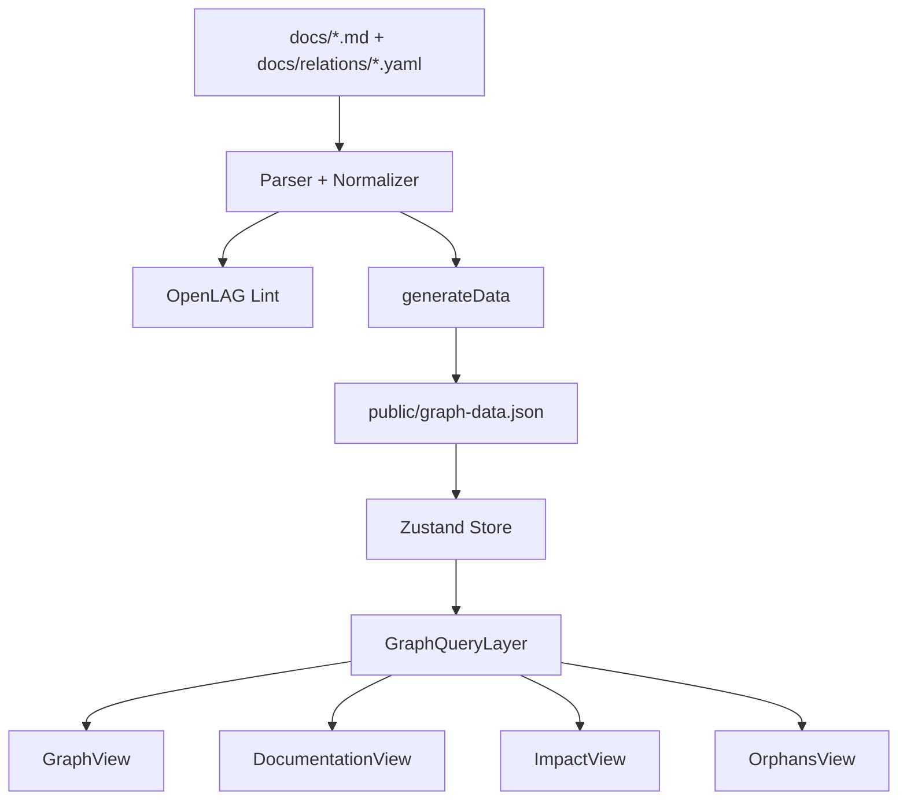
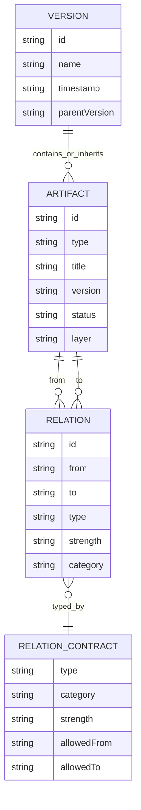

# Documentacion tecnica validada - OpenLAG

Documento validado contra el repositorio del proyecto y el paquete `@donartcha/openlag@0.3.0`.

Fecha de validacion: 2026-05-19.

## 1. Resumen ejecutivo

**Evolución Reciente**: Se ha integrado la especificación *Contract-Driven Impact Evolution*, migrando los tipos anidados y sub-tipos a contratos formales YAML ubicados en `/docs/artifacts/` que configuran la herencia, las validaciones de linter dinámicas, y las direcciones de propagación que ahora son explotadas por el nuevo comando `openlag impact` (permitiendo análisis via git diff nativo sobre CLI).

OpenLAG, Open Living Architecture Graph, es una herramienta de Architecture as Code para convertir documentacion tecnica versionada en Markdown y contratos YAML en un grafo de trazabilidad navegable.

El sistema lee los artefactos de `docs/`, extrae frontmatter y bloques YAML, genera `public/graph-data.json` y sirve una SPA React/Vite para explorar:

- versiones del sistema,
- artefactos arquitectonicos,
- relaciones de trazabilidad,
- huecos de cobertura,
- impacto de cambios,
- documentacion renderizada en Markdown y Mermaid.

La premisa central es mantener la arquitectura cerca del codigo, dentro del repositorio, con IDs estables y relaciones explicitas.

## 2. Estado actual validado

### Version y paquete

- Paquete NPM: `@donartcha/openlag`
- Version local: `0.3.0`
- Binario publicado: `openlag`
- Licencia: `MPL-2.0`
- Runtime soportado: Node.js `>=18`
- Tipo de modulo: ESM (`"type": "module"`)

### Validacion ejecutada

Comandos de validacion ejecutados desde la raiz del proyecto:

```bash
npm run check
npm run generate
node --import tsx scripts/cli/openlag.ts check
node bin/openlag.js --version
npm pack --dry-run
```

Resultado actual:

- `npm run check` pasa correctamente.
- `node bin/openlag.js --version` devuelve `0.3.0`.
- `npm pack --dry-run` genera la tarball `donartcha-openlag-0.3.0.tgz` e incluye la documentacion publica esperada.
- `DOCUMENTACION_OPENLAG.md` permanece excluido del paquete NPM.

Observaciones actuales:

- La inconsistencia publica `TEST` vs `TEST_CASE` fue corregida en artefactos de ejemplo, contratos de relacion, UI y definiciones generadas.
- ESLint sigue mostrando warnings por imports o variables sin uso, pero no errores.
- Vite advierte que algunos chunks superan 500 kB tras minificacion; no bloquea la release, pero queda como mejora futura.

Conclusion: el paquete queda preparado para una release NPM `0.3.0` con documentacion publica coherente y validaciones principales en verde.

## 2.1 Baseline canonica 0.5.x

La baseline canonica de alcance 0.5.x esta en [`OPENLAG_0.5.x_SCOPE_BASELINE.md`](./OPENLAG_0.5.x_SCOPE_BASELINE.md).

Ese documento separa comportamiento implementado de trabajo PROPOSED para 0.5.x. Hasta que las fases correspondientes aterricen, no se debe presentar como implementado: `openlag freeze` / exportacion documental, PDF, Playwright para screenshots, nuevas familias de hallazgos de governance, tooling masivo de autoria o evolucion avanzada del impact engine.

### Limite de governance 0.5.x (implementado vs propuesto)

Familias de governance implementadas hoy mediante contratos YAML:

- `RISK`
- `CHECK`
- `REVIEW`
- `EVIDENCE`
- `INCIDENT`

Familias de hallazgos de governance que siguen en estado PROPOSED:

- `GAP`
- `VIOLATION`
- `DEBT`
- `OBSERVATION`

La evolucion de governance no debe romper compatibilidad con `docs/artifacts/*.yaml`, `docs/relations/*.yaml` ni con los perfiles de lint actuales (`draft`, `feature`, `develop`, `release`).

La documentacion humana debe seguir usando Markdown, los contratos canonicos siguen en `docs/artifacts/*.yaml` y `docs/relations/*.yaml`, y OpenLAG debe conservar el modo static-first sin backend obligatorio.

## 3. Arquitectura general

OpenLAG esta compuesto por tres zonas principales:

1. **Fuente documental**
   - Directorio `docs/`.
   - Artefactos Markdown con YAML estructurado.
   - Contratos de relaciones en `docs/relations/*.yaml`.
   - Metadatos del portal en `metadata.json`.

2. **Motor local de generacion y validacion**
   - CLI en `scripts/cli/openlag.ts`.
   - Parser en `scripts/core/parser.ts` y modulos de `scripts/core/parser/`.
   - Linter en `scripts/lint/`.
   - Generador de contratos TypeScript en `scripts/generate-relations.ts`.

3. **Portal estatico**
   - Frontend React 19 + Vite.
   - Estado global con Zustand en `src/store.ts`.
   - Grafo visual con `@xyflow/react` y `dagre`.
   - Render Markdown/Mermaid en `src/components/MarkdownRenderer.tsx`.
   - Consultas de subgrafo en `src/core/graph/GraphQueryLayer.ts`.
   - Estrategias de proyeccion en `src/core/strategies/`.

No hay backend persistente ni API REST. El contrato principal entre generador y frontend es `public/graph-data.json`.

## 4. Estructura del repositorio

```text
OpenLAG/
  bin/
    openlag.js
  docs/
    architecture/
    artifacts/
    changes/
    ci/
    deployment/
    design/
    implementation/
    incidents/
    maintenance/
    monitoring/
    operations/
    relations/
    requirements/
    testing/
    versions/
  public/
    artifact-definitions.json
    graph-data.json
    relation-definitions.json
  scripts/
    cli/
    core/
    lint/
    generate-relations.ts
  src/
    components/
    core/
      generated/
      graph/
      registry/
      semantic/
      strategies/
    lib/
    utils/
    App.tsx
    store.ts
    types.ts
  tests/
```

Directorios clave:

- `docs/versions/`: versiones globales (`VERSION`) y versiones de sistemas/componentes (`SYSTEM_VERSION`).
- `docs/artifacts/`: contratos YAML de tipos de artefacto, incluyendo extensiones personalizadas.
- `docs/relations/`: contratos YAML de relaciones.
- `scripts/cli/`: comandos `init`, `generate`, `dev`, `build`, `lint`, `preview`, `check`.
- `scripts/core/parser.ts`: extraccion documental y normalizacion.
- `scripts/lint/`: reglas, perfiles y reporte de validacion.
- `src/core/registry/ArtifactRegistry.ts`: tipos oficiales de artefacto.
- `src/core/registry/RelationRegistry.ts`: contratos de relaciones generados.
- `public/artifact-definitions.json`: contratos de artefacto del proyecto activo para el portal estatico.
- `public/relation-definitions.json`: contratos de relacion del proyecto activo para diagnostico y trazabilidad estatica.
- `src/core/generated/relation-definitions.ts`: archivo generado desde `docs/relations/*.yaml`.
- `src/core/graph/GraphQueryLayer.ts`: indices y proyeccion de subgrafos.
- `src/core/strategies/`: agrupaciones semanticas del portal.

Jerarquia de contratos y consumo runtime:

```text
YAML Contracts
    ↓
CLI Resolution
    ↓
Generated Runtime JSON
    ↓
Portal Consumption
```

Los YAML en `docs/artifacts/*.yaml` y `docs/relations/*.yaml` son la fuente de verdad. Los JSON en `public/` son proyecciones runtime para el portal. Los TypeScript generados son artefactos de implementacion, no la fuente canonica de contratos del proyecto.

## 5. Comandos disponibles

### CLI `openlag`

```text
openlag init       Inicializa docs, metadata, relaciones base y contratos de artefacto.
openlag generate   Genera public/graph-data.json.
openlag dev        Genera datos, activa watcher de docs y arranca Vite.
openlag build      Genera datos y construye el portal estatico.
openlag lint       Valida documentacion y relaciones.
openlag preview    Previsualiza dist/.
openlag check      Ejecuta generate + lint de OpenLAG.
openlag impact     Analiza impacto por artefacto, archivo o rango Git.
openlag freeze     Genera una congelacion documental Markdown determinista.
```

Opciones relevantes:

```bash
openlag init --name "Mi Sistema" --desc "Arquitectura del sistema"
openlag init --all
openlag generate --watch
openlag lint --profile feature
openlag lint --profile draft
openlag lint --profile develop
openlag lint --profile release --strict
openlag lint --json
openlag check --profile release --strict
openlag impact --artifact req-registration
openlag impact --from main --to HEAD --json
openlag freeze --profile architecture --format markdown
openlag freeze --profile architecture --dry-run
```

### Documentation freeze

`openlag freeze` genera una instantanea documental Markdown desde el grafo local y un perfil de exportacion.

El perfil por defecto esta en `docs/export-profiles/architecture.yaml` y la salida se escribe en `dist/openlag/exports/<profile>/` salvo que se use `--output`.

PDF queda como fase posterior y debe partir del modelo/export Markdown, no de imprimir el portal React.

### Scripts NPM del repositorio

```text
npm run dev                 Ejecuta tsx scripts/cli/openlag.ts dev.
npm run generate            Ejecuta tsx scripts/cli/openlag.ts generate.
npm run generate-relations  Regenera src/core/generated/relation-definitions.ts.
npm run build               Regenera relaciones, construye web y CLI.
npm run build:web           Ejecuta vite build.
npm run build:cli           Compila la CLI con tsup.
npm run lint                Ejecuta ESLint.
npm run typecheck           Ejecuta tsc --noEmit.
npm run test                Ejecuta node --import tsx --test tests/*.test.ts.
npm run check               Ejecuta typecheck, lint, test y pack dry-run.
npm run clean               Borra dist y public/graph-data.json.
```

### Reportes del Linter
El flujo de reporte vía `openlag lint` provee mensajes ricos, detallados y contextualizados enfocados en la experiencia de desarrollo (DX):
- **Atribución Clara**: Cada infracción etiqueta su ID de artefacto o archivo fuente.
- **Detalle Contractual**: Expone la regla del contrato YAML que falló, indicando si los atributos, relaciones o capas no coinciden.
- **Sugerencias y Soluciones**: La CLI imprime sugerencias accionables directamente en la consola (listado restrictivo de orígenes o destinos en relaciones, capas esperadas por subtipo).
- Soporte oficial y ayuda documentada para nuevos perfiles de entorno, destacando `--profile draft`.
- Además, en esta evolución se ha instrumentado amplia documentación JSDoc a nivel de backend dentro de `src/utils/artifactUtils.ts` para esclarecer métodos internos de resolución dinámica contractual, *layers*, y ascendencia.

Nota importante: no existen scripts `lint:openlag`, `lint:openlag:feature` ni `lint:openlag:release` en el `package.json` actual. Para lint de arquitectura se debe usar `openlag lint` o `tsx scripts/cli/openlag.ts lint`.

## 6. Flujo de ejecucion

### Desarrollo local

```bash
npm install
npm run generate
npm run dev
```

`openlag dev` hace lo siguiente:

1. Resuelve `docs/` desde el proyecto donde se ejecuta.
2. Genera `public/graph-data.json`.
3. Activa un watcher con `chokidar` sobre `docs/`.
4. Arranca Vite usando la configuracion del paquete.
5. Inyecta `OPENLAG_PROJECT_ROOT` para que Vite opere contra el proyecto actual.

### Generacion de datos

`generateData()`:

1. Llama a `parseOpenLagDocs(docsDir)`.
2. Lee `metadata.json` si existe.
3. Construye un estado estatico con:
   - `versions`
   - `systemVersions`
   - `graphs`
   - `changes`
   - `metadata`
4. Para cada version, filtra artefactos por:
   - artefactos `VERSION`,
   - artefactos `SYSTEM_VERSION`,
   - artefactos con `version` igual a la version actual,
   - artefactos heredados por `parentVersion`.
5. Escribe `public/graph-data.json`.

### Runtime del portal

1. `src/main.tsx` monta `src/App.tsx`.
2. `initializeStore()` hace `fetch('/graph-data.json')`.
3. El estado se guarda en Zustand.
4. Al seleccionar version, se construye un `GraphIndex`.
5. `projectSubgraph()` calcula el subgrafo visible con filtros, foco y profundidad.
6. Las vistas `GraphView`, `DocumentationView`, `ImpactView` y `OrphansView` consumen el estado.

## 7. Contrato `graph-data.json`

Forma conceptual:

```ts
interface StaticState {
  versions: Version[];
  systemVersions: SystemVersion[];
  graphs: Record<string, GraphSnapshot>;
  changes: Change[];
  metadata?: {
    name: string;
    description: string;
    [key: string]: unknown;
  };
}
```

Cada `GraphSnapshot` contiene:

```ts
interface GraphSnapshot {
  artifacts: Artifact[];
  relations: Relation[];
}
```

Las relaciones usan `from` y `to`:

```ts
interface Relation {
  id: string;
  from: string;
  to: string;
  type: string;
  strength?: 'STRONG' | 'MEDIUM' | 'WEAK';
  category?: string;
}
```

## 8. Formato oficial de artefactos Markdown

El parser requiere un conjunto minimo de campos estructurales, aunque los contratos YAML pueden ampliar los campos obligatorios mediante `requiredFields`.

Campos estructurales minimos:

- `id`
- `type`
- `title`

Campos recomendados de ciclo de vida:

- `status`
- `version`
- `description`
- `ownership`
- `relations`
- `systemVersionId`

Campos recomendados:

`layer` ya no debe entenderse como un sustituto textual del antiguo `subType`.

En OpenLAG v0.3:

- `type` representa el tipo concreto del artefacto.
- `extends` representa herencia contractual.
- `layer` representa la clasificacion semantica arquitectonica utilizada para validacion, proyeccion y visualizacion.

El valor de `layer` normalmente se resuelve desde el contrato YAML del tipo (`docs/artifacts/*.yaml`) y no necesita repetirse en cada artefacto Markdown.

Ejemplo valido para el parser actual:

```yaml
---
id: req-registration
type: REQUIREMENT
status: ready
layer: BUSINESS
title: User registration
version: v-1
description: Users must be able to create an account with validated data.
ownership:
  owner: product
  team: identity
relations:
  - type: REFINES
    to: epic-identity
---
```

Importante: el parser usa `to` para el destino de una relacion. Tambien acepta relaciones como string o con `id`, pero la forma recomendada y consistente con `Relation` es `to`. No se debe documentar `target` como campo principal mientras `scripts/core/parser.ts` no lo procese.

## 9. Tipos oficiales de artefacto

Declarados en `src/core/registry/ArtifactRegistry.ts`:

```text
PROJECT
EPIC
FEATURE
REQUIREMENT
BUSINESS_RULE
USE_CASE
DESIGN
DECISION
CODE_ENTITY
TEST_CASE
CHANGE
BUG
RISK
GLOSSARY_TERM
COMPONENT
API
DATABASE_ENTITY
DOCUMENTATION
INCIDENT
INFRASTRUCTURE
DEPLOYMENT
MONITORING
MAINTENANCE
SYSTEM_VERSION
VERSION
LIBRARY
ENVIRONMENT
CHECK
PROCESS
PIPELINE
```

Hallazgo resuelto para OpenLAG v0.3: los contratos y artefactos publicos fueron normalizados para usar tipos respaldados por contrato. `subType` y `TEST` no forman parte del modelo legacy v0.2.

### Modelo de resolucion de contratos

OpenLAG resuelve artefactos mediante un modelo guiado por contratos:

- `type` identifica el contrato concreto del artefacto.
- `extends` define herencia desde otro contrato.
- `layer` define la clasificacion semantica arquitectonica utilizada para:
  - validacion de lint,
  - proyeccion del grafo,
  - analisis de impacto,
  - estrategias de visualizacion.

Los contratos oficiales proporcionan capas predefinidas.

Los contratos personalizados pueden:
- redefinir la semantica de capa,
- heredar capas,
- o definir proyecciones semanticas especializadas.

### Contratos generados por `openlag init`

`openlag init` genera los contratos base necesarios para el portal, versionado, documentacion y relaciones obligatorias:

```text
PROJECT
EPIC
FEATURE
REQUIREMENT
USE_CASE
DESIGN
DECISION
CODE_ENTITY
TEST_CASE
CHANGE
BUG
INCIDENT
COMPONENT
API
DATABASE_ENTITY
DOCUMENTATION
SYSTEM_VERSION
VERSION
```

`USE_CASE` e `INCIDENT` son base porque las relaciones obligatorias pueden apuntar a ellos directamente: `TESTS` puede validar un caso de uso, y `FIXES` puede remediar un incidente.

`openlag init --all` agrega contratos oficiales opcionales:

```text
BUSINESS_RULE
RISK
GLOSSARY_TERM
INFRASTRUCTURE
DEPLOYMENT
MONITORING
MAINTENANCE
LIBRARY
ENVIRONMENT
CHECK
PROCESS
PIPELINE
```

`TEST` no se genera ni se recomienda como contrato. Los artefactos de prueba deben modelarse con `TEST_CASE`.

## 10. Estados oficiales

El esquema Zod acepta:

```text
draft
in_progress
ready
closed
deprecated
```

Efectos en lint:

- `draft`: degrada varias reglas a `info`, excepto errores estructurales fuertes.
- `in_progress`: degrada errores no estructurales a `warning`.
- `closed`: exige mayor coherencia; por ejemplo, ownership y relaciones a artefactos no pendientes.
- `deprecated`: se omiten reglas de trazabilidad, salvo validaciones ya calculadas de relaciones rotas.

## 11. Modelo semantico

### Capas

```text
BUSINESS
ARCHITECTURE
IMPLEMENTATION
VERIFICATION
OPERATIONS
GOVERNANCE
DOCUMENTATION
```

### Ownership

```yaml
ownership:
  owner: persona-o-rol
  team: equipo
  domain: dominio
  maintainers:
    - backend
  reviewers:
    - architecture
  steward: governance
```

El linter actual exige ownership especialmente en APIs y artefactos `closed`.

## 12. Relaciones y contratos

Las relaciones se definen en `docs/relations/*.yaml`. Cada contrato incluye:

- `type`
- `description`
- `category`
- `strength`
- `allowedFrom`
- `allowedTo`
- `multiplicity`
- `validation.severity`

Los contratos YAML de `docs/relations/*.yaml` son la fuente de verdad para relaciones. La CLI resuelve esos contratos y emite proyecciones runtime en `public/relation-definitions.json`.

Los archivos TypeScript generados, como `src/core/generated/relation-definitions.ts`, son detalles de implementacion derivados y no sustituyen a los YAML canonicos.

Relaciones presentes actualmente:

```text
BLOCKS
BREAKS
CALLS
DEFINES
DEPENDS_ON
DEPLOYS
DERIVES_FROM
DOCUMENTS
FIXES
IMPACTS
IMPLEMENTS
IMPORTS
JUSTIFIES
MONITORS
REFINES
RELATES_TO
REPLACES
TESTS
USES
VALIDATES
```

`openlag init` genera por defecto solo las relaciones obligatorias: `IMPLEMENTS`, `TESTS`, `REFINES`, `FIXES`, `DOCUMENTS` y `JUSTIFIES`. `openlag init --all` agrega las relaciones opcionales oficiales. En el modo base, `DOCUMENTS` queda acotada a los contratos base; con `--all`, su matriz `allowedTo` se expande para incluir tambien los artefactos opcionales.

Uso recomendado:

- `IMPLEMENTS`: codigo, componente, API o entidad tecnica implementa una necesidad.
- `TESTS`: `TEST_CASE` valida requisito, feature, codigo, API, bug o incidente.
- `REFINES`: descompone un artefacto en otro mas concreto.
- `FIXES`: conecta una correccion con un bug, incidente o riesgo.
- `DOCUMENTS`: conecta documentacion con lo descrito.
- `JUSTIFIES`: conecta decisiones o reglas con el elemento justificado.
- `DEPENDS_ON`, `USES`, `CALLS`, `IMPORTS`: modelan dependencias o uso estructural.
- `RELATES_TO`: debe evitarse salvo justificacion clara.

Las reglas de lint validan el tipo de relación, la existencia del destino, algunas reglas semánticas y aseguran de forma estricta la matriz `allowedFrom`/`allowedTo` definida en los contratos. Si una relación se realiza desde o hacia un artefacto no permitido, el *linter* lo informará como un error o *warning*, dependiendo del perfil.

## 13. Parser documental

Entrada principal: `parseOpenLagDocs(docsDir)`.

Componentes:

- `scanDocs()`: descubre documentos.
- `normalizeArtifact()`: normaliza casing y campos.
- `ArtifactSchema`: valida estructura minima con Zod.
- `DiagnosticEngine`: acumula errores y advertencias.
- `RelationRegistry`: enriquece relaciones con categoria y fuerza.

Comportamiento relevante:

- YAML invalido lanza error critico.
- Bloques sin `id` o `type` se registran como diagnostico invalido.
- Relaciones sin `type` se omiten y generan warning.
- `VERSION`, `SYSTEM_VERSION` y `CHANGE` se copian tambien a listas especializadas del estado.
- El cuerpo Markdown posterior al bloque estructurado se conserva como `body`.

## 14. Linter de arquitectura

Perfiles:

```text
draft
feature
develop
release
```

Reglas actuales:

- `duplicateId`
- `invalidYaml`
- `brokenRelation`
- `missingRequiredFields`
- `requirementWithoutImplementation`
- `requirementWithoutTest`
- `codeWithoutRequirement`
- `closedArtifactWithPendingRelations`
- `orphanArtifact`
- `invalidRelationType`
- `invalidArtifactType`
- `invalidLayerRelation`
- `missingOwnership`

`draft` es el perfil más permisivo (solo bloquea errores críticos como IDs duplicados y YAML inválido), `feature` es tolerante, `develop` es intermedio y `release` convierte mas huecos en errores.

Comandos:

```bash
openlag lint --profile develop
openlag lint --profile release --strict
openlag lint --json
```

Si el binario global no esta instalado, se puede usar `npx @donartcha/openlag <comando>`.

## 15. Frontend y exploracion de grafo

### Vistas principales

- `GraphView`: grafo interactivo con React Flow.
- `DocumentationView`: documentacion agrupada por estrategia semantica.
- `ImpactView`: analisis de impacto por relaciones.
- `OrphansView`: deteccion de huecos y artefactos aislados.
- `GuideView`: guia integrada.
- `SettingsView`: idioma, profundidad y visibilidad de weak relations.

### GraphQueryLayer

`src/core/graph/GraphQueryLayer.ts` crea indices:

- `artifactsById`
- `relationsBySource`
- `relationsByTarget`
- `artifactsByType`
- `artifactsByLayer`
- `artifactsByStatus`
- `artifactsByOwner`
- `artifactsByTeam`

Limites actuales:

```text
MAX_RENDER_NODES = 150
MAX_RENDER_EDGES = 300
DEFAULT_NEIGHBORHOOD_DEPTH = 1
MAX_EXPANSION_DEPTH = 3
HUB_COLLAPSE_THRESHOLD = 25
WEAK_RELATIONS_VISIBLE_BY_DEFAULT = false
```

El sistema puede explorar el grafo completo como base de conocimiento, pero la UI trabaja con subgrafos proyectados para evitar ruido y problemas de rendimiento.

### Personalización de Artefactos (Nuevos Tipos)

OpenLAG define alrededor de 30 artefactos arquitectónicos por defecto. Sin embargo, su diseño permite a cada organización inyectar nuevos tipos a medida.

Al ejecutar `openlag init`, el scaffold crea `docs/artifacts/CUSTOM_TYPE.yaml` como ejemplo intencional de contrato personalizado. No es un tipo oficial del dominio OpenLAG ni un artefacto obligatorio del modelo; sirve para mostrar la sintaxis minima de extension (`extends`, `layer`, `requiredFields`) y puede renombrarse, modificarse o eliminarse cuando el proyecto defina sus tipos reales.

Las extensiones dinamicas permiten reclasificar semanticamente tipos derivados.

Por ejemplo, un proyecto puede extender `TEST_CASE` para crear contratos especializados dentro de la capa `VERIFICATION` sin reintroducir el antiguo tipo `TEST`.

Para añadir un nuevo contrato de artefacto:

1. Crea un fichero `.yaml` en el directorio `docs/artifacts/` del proyecto.
2. Define los campos necesarios. Es posible extender de un tipo base conocido mediante la directiva `extends`:

```yaml
type: CUSTOM_TYPE
extends: CODE_ENTITY
layer: IMPLEMENTATION
description: "Un artefacto personalizado."
requiredFields:
  - id
  - type
  - title
impactSeverityDefault: low
```

3. Cada vez que inicias los scripts de la CLI (`openlag generate`, `openlag dev` o `openlag build`), OpenLAG carga los contratos del proyecto activo y emite datos estaticos en `public/artifact-definitions.json` y `public/relation-definitions.json`. El portal consume estos contratos de artefacto desde `public/` y conserva los contratos empaquetados como fallback. De igual forma para las relaciones: los nuevos conectores semánticos deben emplazarse en `docs/relations/`.

Flujo de generacion contractual:

```text
YAML Contracts
    ↓
CLI Resolution
    ↓
Generated Runtime JSON
    ↓
Portal Consumption
```

Los YAML son la fuente de verdad; los JSON publicos son la proyeccion runtime; los TypeScript generados son detalles de implementacion.

### Personalización Visual (Paleta de Colores)

La vista de grafo (GraphView) asigna colores semánticos a los nodos basándose en su tipo central definidos internamente. Cuando se utiliza un tipo extendido (por ejemplo, `type: DAO` que extiende de `CODE_ENTITY`), el motor hereda el color del ancestro base automáticamente.

Es posible sobrescribir o añadir colores a esta paleta de configuración mediante el archivo `metadata.json`. Agregando la propiedad `typeColors` o `colors`, se puede forzar el estilo de un tipo específico mediante clases de Tailwind (típicamente de texto y borde):

```json
{
  "name": "Mi Proyecto",
  "description": "...",
  "typeColors": {
    "DAO": "text-yellow-400 border-yellow-400",
    "CUSTOM_TYPE": "text-pink-500 border-pink-500"
  }
}
```

### Estrategias de proyeccion

Registradas en `src/core/strategies/index.ts`:

- `lifecycle`
- `dependencies`
- `implementation`
- `validation`
- `architecture`
- `governance`
- `release`
- `domain`

Las estrategias agrupan artefactos para analizar el mismo grafo desde perspectivas diferentes. Con la introducción de **contratos YAML dinámicos**, estas estrategias ya no dependen de un listado cerrado de tipos (`ArtifactType`); en su lugar, leen la propiedad `layer` (fase o capa arquitectónica, por ejemplo, `BUSINESS`, `ARCHITECTURE`, `IMPLEMENTATION`, `VERIFICATION`, `OPERATIONS`, `GOVERNANCE`, `DOCUMENTATION`) declarada en los archivos `.yaml` ubicados bajo `docs/artifacts/`.

Esto asegura que cuando una organización introduzca sus propios artefactos (ej. `API_ROUTE`, `ASYNC_WORKER`), el artefacto caerá naturalmente en la Categoría o Fase correcta del *Sidebar* de visualización dependiendo del `layer` que se le haya asignado en su contrato, y los conteos de la UI englobarán de forma exacta los nuevos sub-tipos inyectados.

Algunas son implementaciones simples o placeholders funcionales, no ordenaciones topologicas completas.

## 16. Seguridad y despliegue

OpenLAG genera un portal estatico. No incluye autenticacion, RBAC ni cifrado de contenido.

Riesgo principal: todo lo escrito en `docs/` puede quedar publicado si `dist/` se despliega en un hosting publico. Esto puede incluir arquitectura interna, componentes sensibles, vulnerabilidades, incidentes o nombres de sistemas.

Recomendaciones:

- Publicar el portal solo en entornos internos o protegidos.
- Revisar `docs/` antes de desplegar.
- No incluir secretos, tokens, contrasenas ni URLs privadas sensibles.
- Usar VPN, autenticacion del servidor estatico o controles del hosting cuando el grafo describa sistemas reales.

## 17. Calidad, deuda y riesgos actuales

### P2

- Corregir warnings de trazabilidad del dataset de ejemplo:
  - codigo sin requisito asociado,
  - requisitos sin implementacion,
  - requisitos sin test.
- Vigilar que nuevos ejemplos publicos mantengan `relations[].to`.

### P3

- Revisar dependencias de exportacion/reporting (`jspdf`, `html-to-image`, `html2canvas`) y confirmar si siguen siendo necesarias.
- Documentar el contrato de `openlag.config.yml`, ya que el linter lo carga pero la documentacion del archivo de configuracion es limitada.
- Decidir si `npm run build` debe generar tambien `public/graph-data.json` en el flujo de paquete o si esa responsabilidad queda solo en `openlag build`.

## 18. Guia rapida para crear documentacion trazable

1. Crear o actualizar un artefacto en `docs/<categoria>/`.
2. Incluir `id`, `type`, `title`, `version` y `description`.
3. Usar `relations[].to`, no `target`.
4. Mantener IDs estables.
5. Preferir relaciones especificas sobre `RELATES_TO`.
6. Ejecutar:

```bash
openlag generate
openlag lint --profile develop
```

7. Para CI completo del repo:

```bash
npm run check
```

## 19. Diagramas

### Pipeline principal



### Modelo conceptual



## 20. Recomendaciones de cierre

Antes de considerar OpenLAG listo para release:

1. Regenerar relaciones con `npm run generate-relations` si cambian los YAML de `docs/relations/`.
2. Ejecutar `npm run typecheck`.
3. Ejecutar `openlag check --profile release --strict` si se quiere validar la arquitectura documental como gate de release.
4. Ejecutar `npm run check`.
5. Ejecutar `node bin/openlag.js --version`.
6. Ejecutar `npm pack --dry-run`.
7. Actualizar esta documentacion si cambian los contratos, comandos o tipos oficiales.
8. Revisar la baseline 0.5.x en `OPENLAG_0.5.x_SCOPE_BASELINE.md` antes de documentar cualquier capacidad nueva como implementada.
