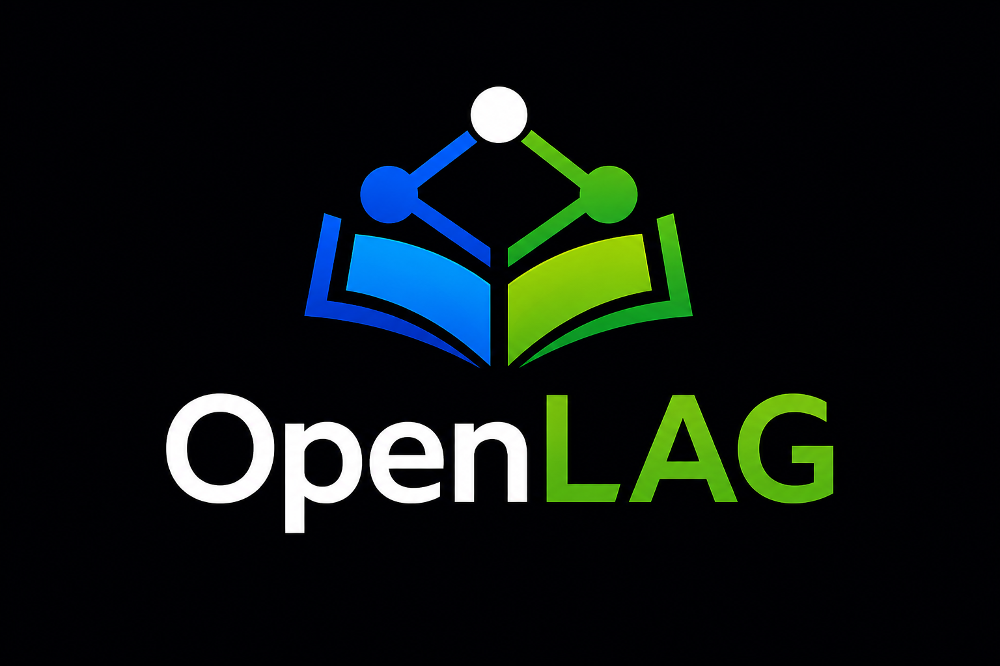

# OpenLAG



OpenLAG is a Documentation-as-Code and Semantic Governance platform for evolving software systems.

It reads versioned architecture documentation from Markdown and YAML files, validates relationships between artifacts, generates a static graph data file, and builds a portal for exploring the resulting traceability graph.

The NPM package is published as `@donartcha/openlag`. The global CLI binary installed by the package is `openlag`.

## Package Status

OpenLAG is in active early development. The current release focuses on a clean CLI workflow, static portal generation, relation contracts, lint profiles, graph exploration, and semantic governance.

## 📘 Architecture Freeze Documentation

OpenLAG can generate deterministic architecture and lifecycle documentation snapshots directly from the Architecture-as-Code graph.

Latest architecture freeze dossier:

- [openlag-architecture.pdf](./openlag-architecture.pdf)

This document includes:
- lifecycle traceability
- requirements and architecture decisions
- implementation boundaries
- verification and governance evidence
- deterministic freeze/export documentation
- version-scoped architecture snapshots

Generated from the OpenLAG lifecycle graph using the freeze workflow.

The tool is designed to be static-first: documentation stays in your repository, OpenLAG generates `public/graph-data.json`, and the portal can be built as static assets.

## 0.5.0 Scope

OpenLAG 0.5.0 uses a lightweight contract-driven core with optional governance, impact, authoring, and official freeze/export subsystems. The broader `0.5.x` line remains available for compatible stabilization patches.

## Install

Install the CLI globally:

```bash
npm install -g @donartcha/openlag
```

Run without a global install:

```bash
npx @donartcha/openlag init
```

## OpenLAG Lite (Starter)

For first-time users and small teams, use the lightweight starter mode:

```bash
npx @donartcha/openlag init --starter
openlag check --profile develop
openlag freeze --profile starter --format markdown
```

`--starter` applies a minimal contract set:

- 4 artifact types: `REQUIREMENT`, `FEATURE`, `CODE_ENTITY`, `TEST_CASE`
- 4 relations: `REFINES`, `IMPLEMENTS`, `TESTS`, `DEPENDS_ON`
- 1 export profile: `starter` (default format: `markdown`, ordering strategy: `lifecycle`)

## Quick Start

```bash
mkdir my-architecture
cd my-architecture
npx @donartcha/openlag init --name "My System"
npx @donartcha/openlag generate
npx @donartcha/openlag lint
npx @donartcha/openlag build
```

OpenLAG creates a `docs/` directory with starter architecture documents, artifact contracts, and relation definitions. `openlag generate` writes `public/graph-data.json`, `public/artifact-definitions.json`, and `public/relation-definitions.json`; `openlag build` writes the static portal to `dist/`.

`--name` sets the project display name in `metadata.json`; it does not create a nested folder. Existing relation and artifact contract files are preserved during initialization.

## CLI Usage

Initialize a project:

```bash
openlag init
```

Generate graph data:

```bash
openlag generate
```

Start the development portal with live data regeneration:

```bash
openlag dev
```

Build the static portal:

```bash
openlag build
```

Validate architecture documentation:

```bash
openlag lint
```

Generate data and validate documentation together:

```bash
openlag check
```

Analyze propagated impact from an artifact, file, or Git diff:

```bash
openlag impact --artifact req-registration
openlag impact --from main --to HEAD --json
```

Generate a deterministic documentation freeze:

```bash
openlag freeze --profile architecture --format markdown
openlag freeze --profile architecture --format json
openlag freeze --profile architecture --format html
openlag freeze --profile architecture --format pdf
openlag freeze --profile architecture --format html --template audit-dossier
openlag freeze --profile architecture --dry-run
```

Show the installed CLI version:

```bash
openlag --version
```

## Commands

```text
openlag init       Initialize docs, metadata, artifact contracts, and relation definitions
openlag generate   Generate public graph/runtime JSON assets
openlag dev        Start the portal dev server with live data refresh
openlag build      Build the static portal
openlag lint       Validate documentation and relations
openlag check      Generate graph data and run OpenLAG lint
openlag impact     Analyze propagated impact from contracts
openlag freeze     Generate deterministic documentation freezes
openlag preview    Preview the production build
```

## Documentation Freeze

OpenLAG generates a deterministic frozen document model from the local graph and an export profile, then renders it as Markdown, JSON, standalone HTML, or PDF.

The default profile lives at `docs/contracts/export-profiles/architecture.yaml`. Generated files go to the directory where the command is executed unless `--output` is provided. If `--output` has an extension, OpenLAG treats it as the target file; otherwise it treats it as a directory and writes the standard `openlag-<profile>.<format>` filename there.

```bash
openlag freeze --profile architecture --format markdown
openlag freeze --profile architecture --format json
openlag freeze --profile architecture --format html
openlag freeze --profile architecture --format pdf
openlag freeze --profile architecture --output exports/architecture
openlag freeze --profile architecture --format html --template technical-manual
openlag freeze --profile architecture --format pdf --template executive-brief
openlag freeze --profile architecture --dry-run
```

Export profiles select artifact types, relation types, sections, ordering, documentary copy, branding, footer text, and rendering flags. HTML and PDF exports use the same frozen model and the same template contract. Bundled template ids are `freeze-template`, `technical-manual`, `executive-brief`, `audit-dossier`, and `knowledge-map`; `--template` can also point to a template HTML path.

HTML output is standalone and offline: vendor bundles for Markdown and Mermaid are injected only into generated output. PDF generation is produced from the frozen document model. It does not print or depend on the React portal.

When a freeze template contains navigable structure (headings, internal anchors, table of contents hierarchy), PDF export preserves that structure as real PDF bookmarks/outline entries in the generated document.

## Profiles and Templates

Bundled profile packs and templates are versioned package assets:

```bash
openlag init --profile core
openlag init --profile governance
openlag init --profile mvc
openlag profile add testing
openlag profile validate --profile governance
```

## Freeze Visual Audit Utility

OpenLAG includes a repository-level QA utility for visual/structural validation of generated freeze PDFs:

```bash
python scripts/qa/run-freeze-visual-audit.py --root .
```

Optional parameters:

- `--pdf-dir` (default: `test-results/freeze`)
- `--template-dir` (default: `templates/freeze`)
- `--report-prefix` (default: `FREEZE_VISUAL_AUDIT_REPORT`)

The utility generates:

- `FREEZE_VISUAL_AUDIT_REPORT.md`
- `FREEZE_VISUAL_AUDIT_REPORT.json`
- `audit-evidence/` (page-by-page visual evidence)

## Lint Profiles

```bash
openlag lint --profile feature
openlag lint --profile develop
openlag lint --profile release --strict
```

- `feature`: relaxed profile for work in progress.
- `develop`: default profile for day-to-day validation.
- `release`: strict profile for release gates.

## Artifact Example

OpenLAG artifacts are Markdown files with YAML frontmatter. Relations use `to` for the destination artifact ID.

```yaml
---
id: req-registration
type: REQUIREMENT
status: ready
layer: BUSINESS
title: User registration
version: v-1
description: Users must be able to create an account with validated data.
ownership:
  owner: product
  team: identity
relations:
  - type: REFINES
    to: epic-identity
---
```

Use `to`, not `target`, in public examples and project documentation.

## Relation Contracts

Relation contracts live in `docs/contracts/relations/*.yaml`. Rule contracts live in `docs/contracts/rules/*.yaml` and are enabled through lint profiles. The default initialization creates the core relation contracts needed for traceability. Optional relation and rule contracts can be added as the project model matures.

Common relations include:

- `IMPLEMENTS`: implementation satisfies a requirement, feature, bug, or API contract.
- `TESTS`: a `TEST_CASE` validates a requirement, feature, code entity, API, bug, or incident.
- `REFINES`: a more concrete artifact refines a broader artifact.
- `FIXES`: a change, component, system version, or code entity fixes a bug, incident, or risk.
- `DOCUMENTS`: documentation describes another artifact.
- `JUSTIFIES`: a decision or rule justifies another artifact.

## Generated Output

```text
public/graph-data.json           Static graph data generated from docs/
public/artifact-definitions.json Project artifact contracts for the portal
public/relation-definitions.json Project relation contracts for the portal
public/rule-definitions.json     Project rule contracts for lint/governance runtime
dist/                            Static portal build output
```

The generated portal is static. Protect it appropriately if the source Markdown contains internal architecture, system names, incidents, vulnerabilities, or operational details.

If contract regeneration fails during `openlag generate`, `openlag dev`, or `openlag build`, OpenLAG logs a warning and continues. Runtime resolution order is:

1. Project contracts under `docs/contracts/**` (when present and successfully resolved)
2. Existing project fallback files in `public/artifact-definitions.json`, `public/relation-definitions.json`, `public/rule-definitions.json`
3. Bundled generated defaults from the package

When neither project contracts nor local fallback files are available for a contract family, OpenLAG now emits an explicit warning for that missing fallback.

## Static Dist Serving

Generated `dist/` folders are static outputs and can be served locally with any simple static server.

```bash
cd internal/dev-sandbox/dist
python3 -m http.server 8080
```

Alternative using Node:

```bash
npm install -g serve
serve /internal/dev-sandbox/dist
```

or:

```bash
cd /internal/dev-sandbox/dist
serve .
```

This serves the already generated static portal as-is.

## Recommended Development Preview Workflow

For active OpenLAG development, regenerate data and rebuild before previewing:

```bash
cd internal/dev-sandbox
npx @donartcha/openlag generate
npx @donartcha/openlag build
npx vite preview
```

This workflow regenerates:

- `public/graph-data.json`
- runtime payloads
- freeze/runtime artifacts
- the static portal build

Then it serves a production-like preview.

Use this when you are evolving docs/contracts/runtime content. Use static `dist/` serving when you only need to inspect an already built output.

## Repository Documentation

- [Specification](./SPECIFICATION.md): conceptual model, artifact types, relation model, project structure, and runtime contract boundaries.
- [Why OpenLAG](./WHY_OPENLAG.md): rationale and problem framing behind the project.
- [Changelog](./CHANGELOG.md): release history.
- [Security](./SECURITY.md): security considerations and vulnerability reporting.
- [Contributing](./CONTRIBUTING.md): local development and PR workflow.

Internal audit notes are intentionally not published as NPM documentation.  
`WHY_OPENLAG.md` is repository documentation and is not currently included in the npm package artifact list.

## License

MPL-2.0. See [LICENSE](LICENSE).
