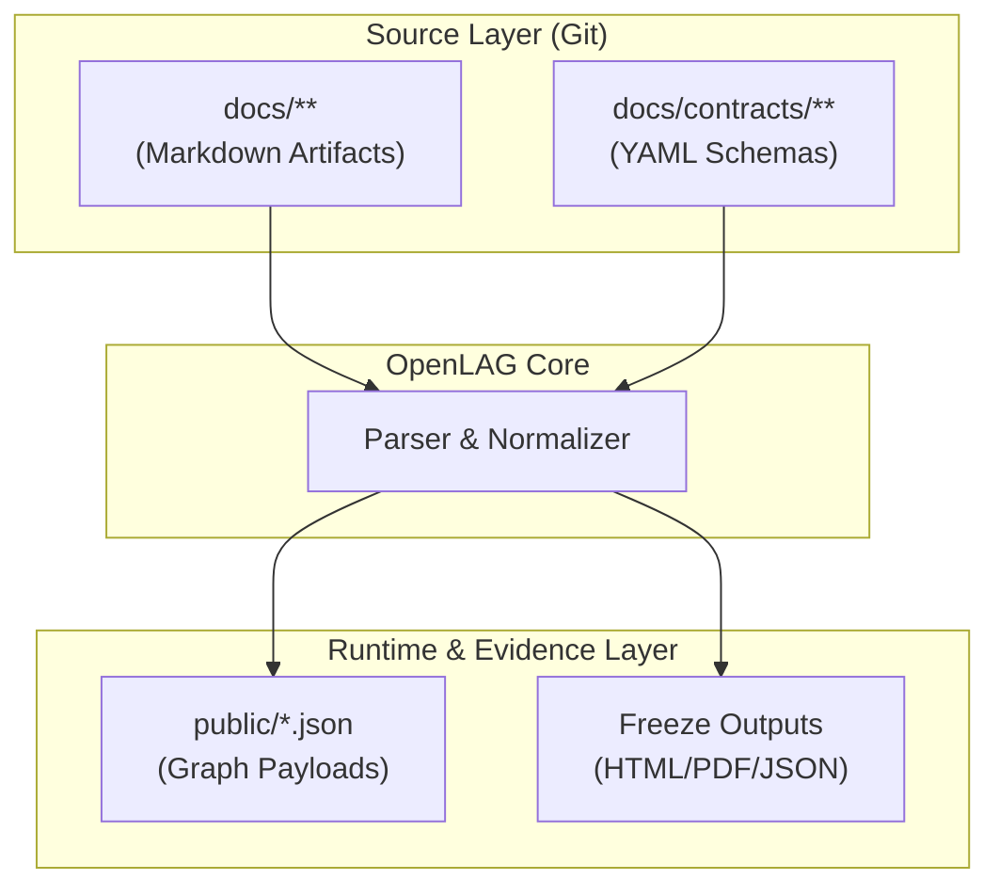

# Contract-Driven Lifecycle Graph Design

This design captures the 0.5.0 graph architecture: source artifacts under `docs/**` and contracts under `docs/contracts/**` are parsed, validated, and compiled into runtime payloads (`public/*.json`) and freeze outputs.

It exists because 0.4.0 behavior was correct but under-explained. 0.5.0 formalizes the transformation path so deterministic behavior and lifecycle traceability are explicit.

The impact is direct on generation and validation flows: lifecycle narratives, relations, and governance policies become executable graph inputs instead of passive documentation.

## Pipeline Architecture

