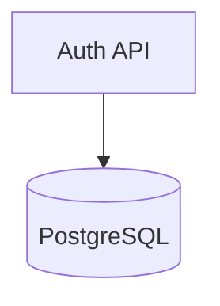

# ADR-001: Use Postgres
## Contexto
Necesitamos una base de datos para almacenar información de usuarios y transacciones con integridad relacional.

## Decisión
Hemos decidido usar PostgreSQL en lugar de MongoDB.

## Consecuencias
* Propiedades ACID garantizadas.
* Mayor facilidad para reportes complejos.

