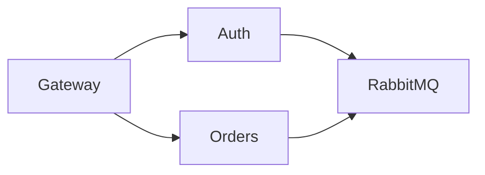

Arquitectura basada en eventos usando RabbitMQ para la comunicación entre servicios.

```mermaid
graph LR
  Gateway --> Auth
  Gateway --> Orders
  Auth --> EventBus[RabbitMQ]
  Orders --> EventBus
```
